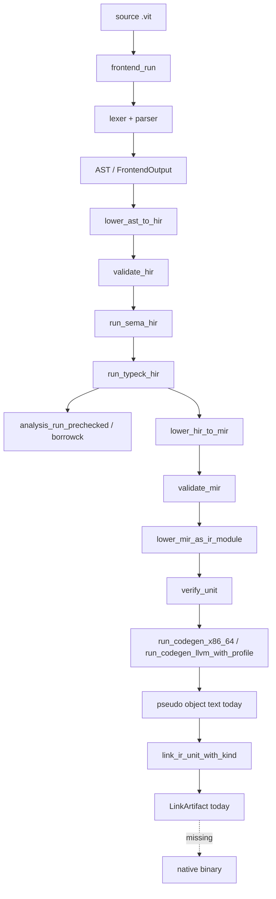

# AUDIT - Vitte compiler real pipeline

Date: 2026-05-21

## Verdict court

Le depot contient beaucoup de pipeline compiler reel (frontend, HIR, sema, typeck, MIR, IR, codegen, link artifact), mais le binaire actuel n'est pas encore un compilateur natif complet au sens `source -> objet machine -> linker -> executable`.

Le point d'entree source est bien `src/vitte/compiler/driver/compiler.vit`. `main(args)` est maintenant cable cote source, mais le runtime CLI actuel vient encore du bootstrap genere tant que stage2 ne compile pas ce point d'entree en executable natif.

## Executables trouves

Total fichiers visibles par `find . -type f`: 7929. Fichiers hors caches/build/target/pkgout: 2096.

```text
bin/vitte
bin/vittec
bin/vittec0
bin/vittec1
docs/book/chapters/keywords/scripts/lint_keywords.py
docs/book/chapters/keywords/scripts/normalize_keywords.py
docs/book/grammar/scripts/build_railroad.py
docs/book/grammar/scripts/sync_grammar.py
docs/book/grammar/scripts/validate_examples.py
docs/book/scripts/add_representative_examples.py
docs/book/scripts/check_chapter_length.py
docs/book/scripts/check_links.py
docs/book/scripts/check_structure.py
docs/book/scripts/expand_chapters_to_min_length.py
docs/book/scripts/generate_poche_chapters.py
docs/book/scripts/humanize_chapters.py
docs/book/scripts/lint_keywords_style.py
docs/book/scripts/qa_book.py
docs/book/scripts/rewrite_11_20_human.py
docs/book/scripts/rewrite_first10_human.py
docs/book/scripts/sync_grammar_surface.py
editors/geany/install_geany.sh
editors/geany/uninstall_geany.sh
scripts/seed/install_seed.sh
scripts/seed/rotation_report.sh
scripts/seed/update_manifest.sh
scripts/seed/verify_seed.sh
tests/docs/test_ebnf_memory_sync.py
tests/docs/test_grammar_sync.py
toolchain/bootstrap.sh
toolchain/scripts/bootstrap/stage1.sh
toolchain/scripts/bootstrap/stage2.sh
toolchain/scripts/bootstrap/verify.sh
toolchain/scripts/ci/artifacts.sh
toolchain/scripts/ci/github-actions.sh
toolchain/scripts/dev/repl.sh
toolchain/scripts/dev/run-vittec.sh
toolchain/scripts/install/install-local.sh
toolchain/scripts/install/install-prefix.sh
toolchain/scripts/package/audit-debian-deb.sh
toolchain/scripts/package/bundle-runtime.sh
toolchain/scripts/package/bundle-stdlib.sh
toolchain/scripts/package/bundle-toolchain.sh
toolchain/scripts/package/checksum.sh
toolchain/scripts/package/make-archive.sh
toolchain/scripts/package/make-debian-deb.sh
toolchain/scripts/package/make-debian-uninstall-deb.sh
toolchain/scripts/package/make-macos-pkg.sh
toolchain/scripts/package/make-macos-uninstall-pkg.sh
toolchain/scripts/package/make-tarball.sh
toolchain/scripts/test/run.sh
toolchain/scripts/test/stdlib.sh
toolchain/seed/vittec0.seed
toolchain/test_bootstrap_reproducibility.sh
tools/beta_feedback/generate_kpi_report.py
tools/beta_feedback/update_matrix_from_summary.py
tools/beta_feedback/validate_feedback_csv.py
tools/bootstrap_contracts_index_check.sh
tools/bootstrap_hard_gate.py
tools/bootstrap_native_fixture_matrix.sh
tools/bootstrap_native_snapshots.sh
tools/bootstrap_posix_smoke.sh
tools/bootstrap_selfhost_repro.sh
tools/bootstrap_vitte_hard_gate.sh
tools/build_arduino_projects.sh
tools/build_book_learning_layer.py
tools/build_core_projects.sh
tools/build_docs_site.py
tools/build_examples_matrix.sh
tools/build_grammar_extras.py
tools/build_grammar_practical_page.py
tools/check_book_pedagogy.py
tools/check_bootstrap_native_drift.sh
tools/check_bootstrap_source_coverage.sh
tools/check_broken_internal_links.py
tools/check_compiler_entry_lock.sh
tools/check_compiler_path_typos.sh
tools/check_diagnostics_migration.sh
tools/check_docs_en_only.py
tools/check_docs_perf.py
tools/check_geany_install.sh
tools/check_html_page_sizes.py
tools/check_manifest.sh
tools/check_module_shape_policy.py
tools/check_no_duplicate_css.py
tools/check_no_duplicate_scripts.py
tools/check_posix_seed_shell.sh
tools/check_seed_contract.sh
tools/check_stage2_source_of_truth.sh
tools/check_stdlib_abi_compat.py
tools/check_tests.sh
tools/ci_fast_compiler.sh
tools/ci_surface_legacy_audit.sh
tools/cli_diagnostics_snapshots.sh
tools/compile_all_compiler_files.sh
tools/compiler_effective_gate/check.py
tools/compiler_max_gate.sh
tools/compiler_reachability_audit.py
tools/compiler_topology/generate_artifacts.py
tools/compiler_topology/run_checks.py
tools/completions_fallback_test.sh
tools/completions_snapshots.sh
tools/contracts_dashboard.py
tools/crash_report_snapshots.sh
tools/determinism_smoke.sh
tools/diag_snapshots.sh
tools/docs/check_assets_policy.py
tools/docs/post_deploy_css_monitor.sh
tools/docs/refresh_assets_policy.py
tools/docs/verify_local_pages.sh
tools/docs_doctor.py
tools/docs_health_all.sh
tools/docs_pipeline.sh
tools/docs_sync_gate.py
tools/doctor.sh
tools/dx_hello_prod_bench.py
tools/explain_snapshots.sh
tools/ffi/generate_abi_coverage_report.py
tools/ffi/update_matrix_abi_coverage.py
tools/ffi/validate_abi_profiles.py
tools/fix_broken_script_tags.py
tools/frequent_diag_autofix_check.py
tools/generate_editor_highlights.py
tools/generate_legacy_migration_doc.py
tools/generate_make_targets_doc.py
tools/generate_vitteos_status.sh
tools/golden_runner
tools/highlight_snapshot_emacs.sh
tools/highlight_snapshot_geany.sh
tools/highlight_snapshot_nano.sh
tools/highlight_snapshot_vim.sh
tools/highlights_coverage.py
tools/highlights_snapshot.py
tools/hooks/pre-commit-modules-snapshots.sh
tools/incremental_cache_smoke.sh
tools/interproc_opt/generate_artifacts.py
tools/interproc_opt/run_checks.py
tools/lint_contract_lockfiles.py
tools/lint_critical_module_contracts.py
tools/lint_critical_runtime_matrix.py
tools/lint_docs_tokens.py
tools/lint_experimental_modules.py
tools/lint_legacy_import_paths.py
tools/lint_module_naming.py
tools/lint_module_tree.py
tools/lint_new_public_packages_have_snapshots.py
tools/lint_no_std_imports.py
tools/lint_package_layout.py
tools/lint_packages_governance.py
tools/lint_plugin_manifest.py
tools/lint_plugin_sandbox_permissions.py
tools/lint_public_modules_have_snapshots.py
tools/lint_stdlib_api.py
tools/llvm/generate_artifacts.py
tools/llvm/run_checks.py
tools/llvm/write_native_manifest.py
tools/lsp_completion_bench.py
tools/migrate_book_pedagogy_target.py
tools/migration_fix_preview.sh
tools/minify_assets.sh
tools/mir_opt/generate_artifacts.py
tools/mir_opt/run_checks.py
tools/mod_migrate_imports.sh
tools/modules_snapshots.sh
tools/modules_tests.sh
tools/native_json_schema_contract_test.sh
tools/negative_tests.sh
tools/new_module_starter.sh
tools/optimization_phase2/generate_kpi_report.py
tools/optimization_phase2/update_matrix_from_summary.py
tools/optimization_phase2/validate_phase2_csv.py
tools/package_check_all.sh
tools/package_check_portable.sh
tools/packages_contract_snapshots.sh
tools/parse_modules_tests.sh
tools/parse_tests.sh
tools/parse_watch.sh
tools/parser_bootstrap_surface_test.py
tools/parser_lexer_fuzz_smoke.py
tools/perf_budget_check.py
... (35 more)
```

## Vrai main CLI

- Entree stage2 declaree: `src/vitte/compiler/driver/compiler.vit`.
- `src/vitte/compiler/driver/compiler.vit::main(args)`: dispatcher source cable.
- Commandes runtime observees par `./bin/vittec --help`:

```text
vittec2 stage2 compiler driver
version: vittec2 stage2-vitte 0.1.0
commands: parse check build-native dump-native-ir build selfhost-source --version --help
flags: --src PATH --out PATH --stage NAME --trace-pipeline --strict --dump-ast-json --dump-hir-json --dump-mir-json --diagnostics-json
```

## Commandes build/check/run/test

- `vittec check tests/golden/frontend/fixtures/hello_min.vit`: rc=0.
- `vittec build tests/golden/frontend/fixtures/hello_min.vit -o target/audit_hello`: rc=2.
- `vittec run tests/golden/frontend/fixtures/hello_min.vit`: rc=2.
- `vittec test tests/golden/frontend/fixtures/hello_min.vit`: rc=2.

Sorties importantes:

```text
[vittec2][error] E_CLI_STAGE: unsupported stage:  (hint: supported: stage1)
[vittec2][error] E_CLI_COMMAND: unknown command: run (hint: use --help to list commands)
[vittec2][error] E_CLI_COMMAND: unknown command: test (hint: use --help to list commands)
```

## Graphe du pipeline reel



## Modules compiler/*

- Modules `.vit` sous `src/vitte/compiler`: 220.
- Modules non-test atteignables depuis `driver/compiler`: 194 / 194.
- Modules non-test atteignables depuis les racines de pipeline reel (`driver/compile`, `driver/pipeline`, `backend/pipeline`): 61 / 194.

## Modules morts ou non utilises par le pipeline reel

```text
vitte/compiler/analysis/borrowck/lifetimes
vitte/compiler/analysis/borrowck/loans
vitte/compiler/analysis/borrowck/mod
vitte/compiler/analysis/borrowck/moves
vitte/compiler/analysis/borrowck/ownership
vitte/compiler/analysis/borrowck/regions
vitte/compiler/analysis/const_eval/evaluator
vitte/compiler/analysis/const_eval/folding
vitte/compiler/analysis/const_eval/interpreter
vitte/compiler/analysis/const_eval/mod
vitte/compiler/analysis/lint/engine
vitte/compiler/analysis/lint/mod
vitte/compiler/analysis/lint/report
vitte/compiler/analysis/lint/rules
vitte/compiler/analysis/mod
vitte/compiler/analysis/sema/mod
vitte/compiler/analysis/sema/modules
vitte/compiler/analysis/sema/names
vitte/compiler/analysis/sema/resolver
vitte/compiler/analysis/sema/visibility
vitte/compiler/analysis/static/mod
vitte/compiler/analysis/typeck/mod
vitte/compiler/backend/codegen/emitter
vitte/compiler/backend/codegen/instruction_select
vitte/compiler/backend/codegen/machine
vitte/compiler/backend/codegen/mod
vitte/compiler/backend/codegen/object
vitte/compiler/backend/codegen/register_alloc
vitte/compiler/backend/ir/block
vitte/compiler/backend/ir/function
vitte/compiler/backend/ir/instruction
vitte/compiler/backend/ir/mod
vitte/compiler/backend/ir/module
vitte/compiler/backend/ir/verify
vitte/compiler/backend/link/mod
vitte/compiler/backend/mod
vitte/compiler/backend/target/mod
vitte/compiler/backend/target/riscv64
vitte/compiler/backend/target/x86_64
vitte/compiler/backends/backend_infrastructure
vitte/compiler/backends/c_emit
vitte/compiler/backends/llvm_bindings/mod
vitte/compiler/backends/llvm_emit
vitte/compiler/backends/vitte_emit/abi_bridge
vitte/compiler/backends/vitte_emit/cfg
vitte/compiler/backends/vitte_emit/config
vitte/compiler/backends/vitte_emit/contracts
vitte/compiler/backends/vitte_emit/emit
vitte/compiler/backends/vitte_emit/intrinsics
vitte/compiler/backends/vitte_emit/ir
vitte/compiler/backends/vitte_emit/lowering
vitte/compiler/backends/vitte_emit/mod
vitte/compiler/backends/vitte_emit/passes
vitte/compiler/backends/vitte_emit/pipeline
vitte/compiler/backends/vitte_emit/types
vitte/compiler/backends/vitte_emit/validate
vitte/compiler/backends/wasm/mod
vitte/compiler/diagnostics/json
vitte/compiler/diagnostics/lsp
vitte/compiler/diagnostics/mod
vitte/compiler/diagnostics/render
vitte/compiler/diagnostics/report
vitte/compiler/driver/bootstrap_pipeline
vitte/compiler/driver/cli
vitte/compiler/driver/compilation_pipeline
vitte/compiler/driver/compiler
vitte/compiler/driver/integration_orchestrator
vitte/compiler/driver/mod
vitte/compiler/frontend/ast/mod
vitte/compiler/frontend/ast/pretty
vitte/compiler/frontend/ast/visitor
vitte/compiler/frontend/grammar_alignment_checker
vitte/compiler/frontend/lexer/mod
vitte/compiler/frontend/macros/errors
vitte/compiler/frontend/macros/mod
vitte/compiler/frontend/mod
vitte/compiler/frontend/parse/lookahead
vitte/compiler/frontend/parse/mod
vitte/compiler/frontend/parse/precedence
vitte/compiler/frontend/source_map
vitte/compiler/infrastructure/diagnostics/colors
vitte/compiler/infrastructure/diagnostics/diagnostic
vitte/compiler/infrastructure/diagnostics/emitter
vitte/compiler/infrastructure/diagnostics/labels
vitte/compiler/infrastructure/diagnostics/mod
vitte/compiler/infrastructure/diagnostics/suggestions
vitte/compiler/infrastructure/errors/code
vitte/compiler/infrastructure/errors/mod
vitte/compiler/infrastructure/errors/registry
vitte/compiler/infrastructure/errors/severity
vitte/compiler/infrastructure/incremental/dep_graph
vitte/compiler/infrastructure/incremental/fingerprint
vitte/compiler/infrastructure/incremental/invalidation
vitte/compiler/infrastructure/incremental/mod
vitte/compiler/infrastructure/incremental/reuse
vitte/compiler/infrastructure/mod
vitte/compiler/infrastructure/session/config
vitte/compiler/infrastructure/session/context
vitte/compiler/infrastructure/session/files
vitte/compiler/infrastructure/session/mod
vitte/compiler/infrastructure/session/options
vitte/compiler/ir/ast
vitte/compiler/ir/hir_to_mir_lowering
vitte/compiler/ir/mir_extended
vitte/compiler/ir/mir_optimizations
vitte/compiler/ir/pipeline
vitte/compiler/middle/borrow/checks
vitte/compiler/middle/borrow/mod
vitte/compiler/middle/borrow/regions
vitte/compiler/middle/dataflow/cfg
vitte/compiler/middle/dataflow/liveness
vitte/compiler/middle/dataflow/mod
vitte/compiler/middle/hir/builder
vitte/compiler/middle/hir/control_flow
vitte/compiler/middle/hir/mod
vitte/compiler/middle/hir/pretty
vitte/compiler/middle/infer/constraints
vitte/compiler/middle/infer/mod
vitte/compiler/middle/infer/solver
vitte/compiler/middle/lower/lowering_context
vitte/compiler/middle/lower/mod
vitte/compiler/middle/mir/builder
vitte/compiler/middle/mir/dataflow
vitte/compiler/middle/mir/mod
vitte/compiler/middle/mir/pretty
vitte/compiler/middle/mir/transform
vitte/compiler/middle/mod
vitte/compiler/middle/typecheck/diagnostics
vitte/compiler/middle/typecheck/mod
vitte/compiler/middle/typecheck/rules
vitte/compiler/mod
vitte/compiler/prelude
vitte/compiler/version
```

## Placeholders / stubs / mocks / unimplemented

```text
AUDIT.md:202: - `src/vitte/compiler/driver/compiler.vit::main(args)` est encore un placeholder (`give 0`).
AUDIT.md:394: ## Placeholders / stubs / mocks / unimplemented
AUDIT.md:397: AUDIT.md:202: - `src/vitte/compiler/driver/compiler.vit::main(args)` est encore un placeholder (`give 0`).
AUDIT.md:398: AUDIT.md:394: ## Placeholders / stubs / mocks / unimplemented
AUDIT.md:399: AUDIT.md:397: AUDIT.md:202: - `src/vitte/compiler/driver/compiler.vit::main(args)` est encore un placeholder (`give 0`).
AUDIT.md:400: AUDIT.md:398: AUDIT.md:394: ## Placeholders / stubs / mocks / unimplemented
AUDIT.md:401: AUDIT.md:399: AUDIT.md:397: AUDIT.md:202: - `src/vitte/compiler/driver/compiler.vit::main(args)` est encore un placeholder (`give 0`).
AUDIT.md:402: AUDIT.md:400: AUDIT.md:398: AUDIT.md:394: ## Placeholders / stubs / mocks / unimplemented
AUDIT.md:403: AUDIT.md:401: AUDIT.md:399: AUDIT.md:397: CHANGELOG.md:11: - Replaced bootstrap placeholder payloads with deterministic structural metrics extracted from real compiler sources.
AUDIT.md:404: AUDIT.md:402: AUDIT.md:400: AUDIT.md:398: CHANGELOG.md:59: - **Driver pipeline wiring**: `src/vitte/compiler/driver/compiler.vit` now calls real frontend/analysis/middle/backend pipeline surfaces instead of placeholder-only stage hops.
AUDIT.md:405: AUDIT.md:403: AUDIT.md:401: AUDIT.md:399: docs/COMPILER_DRIVER_MIGRATION.md:59: - `--panic-budget`
AUDIT.md:406: AUDIT.md:404: AUDIT.md:402: AUDIT.md:400: docs/beta_program/bug_fixing_iteration/TRIAGE.md:13: - BETA-105 (Minor): package registry mock URL not shown in logs
AUDIT.md:407: AUDIT.md:405: AUDIT.md:403: AUDIT.md:401: docs/book/code/project-autonomous-operations.vit:71: use vitte/mock_http as m64
AUDIT.md:408: AUDIT.md:406: AUDIT.md:404: AUDIT.md:402: docs/book/code/project-autonomous-operations.vit:306: tags = tags.push("vitte/mock_http")
AUDIT.md:409: AUDIT.md:407: AUDIT.md:405: AUDIT.md:403: docs/book/code/project-enterprise-fabric.vit:71: use vitte/mock_http as m64
AUDIT.md:410: AUDIT.md:408: AUDIT.md:406: AUDIT.md:404: docs/book/code/project-enterprise-fabric.vit:306: tags = tags.push("vitte/mock_http")
AUDIT.md:411: AUDIT.md:409: AUDIT.md:407: AUDIT.md:405: docs/book/code/project-kernel-control-plane.vit:71: case Panic(reason: string)
AUDIT.md:412: AUDIT.md:410: AUDIT.md:408: AUDIT.md:406: docs/book/code/project-kernel-control-plane.vit:111: if !validate_boot(c) { give KernelState.Panic("invalid boot config") }
AUDIT.md:413: AUDIT.md:411: AUDIT.md:409: AUDIT.md:407: docs/book/code/project-kernel-network-fabric.vit:71: case Panic(reason: string)
AUDIT.md:414: AUDIT.md:412: AUDIT.md:410: AUDIT.md:408: docs/book/code/project-kernel-network-fabric.vit:111: if !validate_boot(c) { give KernelState.Panic("invalid boot config") }
AUDIT.md:415: AUDIT.md:413: AUDIT.md:411: AUDIT.md:409: docs/book/code/project-kernel-storage-runtime.vit:71: case Panic(reason: string)
AUDIT.md:416: AUDIT.md:414: AUDIT.md:412: AUDIT.md:410: docs/book/code/project-kernel-storage-runtime.vit:111: if !validate_boot(c) { give KernelState.Panic("invalid boot config") }
AUDIT.md:417: AUDIT.md:415: AUDIT.md:413: AUDIT.md:411: docs/book/code/project-unified-platform.vit:71: use vitte/mock_http as m64
AUDIT.md:418: AUDIT.md:416: AUDIT.md:414: AUDIT.md:412: docs/book/code/project-unified-platform.vit:306: tags = tags.push("vitte/mock_http")
AUDIT.md:419: AUDIT.md:417: AUDIT.md:415: AUDIT.md:413: docs/book/grammar/railroad/README.md:143: - [panic_stmt](./panic_stmt.svg)
AUDIT.md:420: AUDIT.md:418: AUDIT.md:416: AUDIT.md:414: docs/bootstrap_migration_checklist.md:17: - [x] Replace `toolchain/stage1` host stub implementation with Vitte sources only.
AUDIT.md:421: AUDIT.md:419: AUDIT.md:417: AUDIT.md:415: docs/bootstrap_migration_checklist.md:28: - [x] Replace `toolchain/stage2` host stub implementation with Vitte sources only.
AUDIT.md:422: AUDIT.md:420: AUDIT.md:418: AUDIT.md:416: src/vitte/compiler/backends/llvm_emit.vit:107: proc emit_llvm_runtime_stubs(ctx: *LLVMGenContext) {
AUDIT.md:423: AUDIT.md:421: AUDIT.md:419: AUDIT.md:417: src/vitte/compiler/backends/llvm_emit.vit:108: ctx.ir_buffer = ctx.ir_buffer + "; Runtime library stubs\n"
AUDIT.md:424: AUDIT.md:422: AUDIT.md:420: AUDIT.md:418: src/vitte/compiler/backends/llvm_emit.vit:264: // Emit runtime stubs
AUDIT.md:425: AUDIT.md:423: AUDIT.md:421: AUDIT.md:419: src/vitte/compiler/backends/llvm_emit.vit:265: emit_llvm_runtime_stubs(ctx)
AUDIT.md:426: AUDIT.md:424: AUDIT.md:422: AUDIT.md:420: src/vitte/compiler/diagnostics/catalog.vit:419: "RUNTIME_E_PANIC",
AUDIT.md:427: AUDIT.md:425: AUDIT.md:423: AUDIT.md:421: src/vitte/compiler/diagnostics/catalog.vit:422: "runtime panic",
AUDIT.md:428: AUDIT.md:426: AUDIT.md:424: AUDIT.md:422: src/vitte/compiler/frontend/ast/pretty.vit:104: if kind == AstStmtKind.Panic { give "panic"; }
AUDIT.md:429: AUDIT.md:427: AUDIT.md:425: AUDIT.md:423: src/vitte/compiler/frontend/ast/stmt.vit:52: Panic,
AUDIT.md:430: AUDIT.md:428: AUDIT.md:426: AUDIT.md:424: src/vitte/compiler/frontend/ast/stmt.vit:120: elif kind == AstStmtKind.Panic { give "panic"; }
AUDIT.md:431: AUDIT.md:429: AUDIT.md:427: AUDIT.md:425: src/vitte/compiler/frontend/ast/stmt.vit:466: or kind == AstStmtKind.Panic
AUDIT.md:432: AUDIT.md:430: AUDIT.md:428: AUDIT.md:426: src/vitte/compiler/frontend/lexer/literals.vit:124: if text == "defer" or text == "asm" or text == "emit" or text == "assert" or text == "panic" or text == "unreachable" { give true; }
AUDIT.md:433: AUDIT.md:431: AUDIT.md:429: AUDIT.md:427: src/vitte/compiler/frontend/parse/parser.vit:1023: if at_text(current, "emit") or at_text(current, "panic") {
AUDIT.md:434: AUDIT.md:432: AUDIT.md:430: AUDIT.md:428: src/vitte/compiler/ir/ast.vit:56: Panic,
AUDIT.md:435: AUDIT.md:433: AUDIT.md:431: AUDIT.md:429: src/vitte/compiler/ir/ast.vit:457: if kind == AstStmtKind.Panic { give "panic"; }
AUDIT.md:436: AUDIT.md:434: AUDIT.md:432: AUDIT.md:430: src/vitte/compiler/middle/dataflow/cfg.vit:39: Panic,
AUDIT.md:437: AUDIT.md:435: AUDIT.md:433: AUDIT.md:431: src/vitte/compiler/middle/dataflow/cfg.vit:297: if kind == CfgTerminatorKind.Panic { give "panic"; }
AUDIT.md:438: AUDIT.md:436: AUDIT.md:434: AUDIT.md:432: src/vitte/compiler/middle/hir/control_flow.vit:63: Panic,
AUDIT.md:439: AUDIT.md:437: AUDIT.md:435: AUDIT.md:433: src/vitte/compiler/middle/hir/control_flow.vit:291: if kind == HirTerminatorKind.Panic { give "panic"; }
AUDIT.md:440: AUDIT.md:438: AUDIT.md:436: AUDIT.md:434: src/vitte/compiler/middle/hir/hir.vit:105: Panic,
AUDIT.md:441: AUDIT.md:439: AUDIT.md:437: AUDIT.md:435: src/vitte/compiler/middle/hir/hir.vit:522: or stmt.kind == HirStmtKind.Panic
AUDIT.md:442: AUDIT.md:440: AUDIT.md:438: AUDIT.md:436: src/vitte/compiler/middle/hir/lower_ast.vit:97: elif kind == AstStmtKind.Panic { give HirStmtKind.Panic; }
AUDIT.md:443: AUDIT.md:441: AUDIT.md:439: AUDIT.md:437: src/vitte/compiler/middle/hir/lower_ast.vit:348: or stmt.kind == AstStmtKind.Panic
AUDIT.md:444: AUDIT.md:442: AUDIT.md:440: AUDIT.md:438: src/vitte/compiler/middle/hir/pretty.vit:100: elif kind == HirStmtKind.Panic { give "panic" }
AUDIT.md:445: AUDIT.md:443: AUDIT.md:441: AUDIT.md:439: src/vitte/packages/compiler/driver/internal/compiler_ast.vit:94: Panic,
AUDIT.md:446: AUDIT.md:444: AUDIT.md:442: AUDIT.md:440: src/vitte/packages/compiler/driver/internal/compiler_emit.vit:359: if stmt.kind == "panic" {
AUDIT.md:447: AUDIT.md:445: AUDIT.md:443: AUDIT.md:441: src/vitte/packages/compiler/driver/internal/compiler_emit.vit:362: + "panic("
AUDIT.md:448: AUDIT.md:446: AUDIT.md:444: AUDIT.md:442: src/vitte/packages/compiler/driver/internal/compiler_ir.vit:30: Panic,
AUDIT.md:449: AUDIT.md:447: AUDIT.md:445: AUDIT.md:443: src/vitte/packages/compiler/driver/internal/compiler_ir.vit:313: if kind == compiler_ast.StmtKind.Panic {
AUDIT.md:450: AUDIT.md:448: AUDIT.md:446: AUDIT.md:444: src/vitte/packages/compiler/driver/internal/compiler_ir.vit:314: give "panic";
AUDIT.md:451: AUDIT.md:449: AUDIT.md:447: AUDIT.md:445: src/vitte/packages/compiler/driver/internal/compiler_ir.vit:368: if kind == compiler_ast.StmtKind.Panic {
AUDIT.md:452: AUDIT.md:450: AUDIT.md:448: AUDIT.md:446: src/vitte/packages/compiler/driver/internal/compiler_ir.vit:369: give IrStmtKind.Panic;
AUDIT.md:453: AUDIT.md:451: AUDIT.md:449: AUDIT.md:447: src/vitte/packages/compiler/driver/internal/normalized_options.vit:23: panic_budget: int,
AUDIT.md:454: AUDIT.md:452: AUDIT.md:450: AUDIT.md:448: src/vitte/packages/compiler/driver/internal/normalized_options.vit:24: panic_budget_notes: int,
AUDIT.md:455: AUDIT.md:453: AUDIT.md:451: AUDIT.md:449: src/vitte/packages/compiler/driver/internal/normalized_options.vit:51: panic_budget: int,
AUDIT.md:456: AUDIT.md:454: AUDIT.md:452: AUDIT.md:450: src/vitte/packages/compiler/driver/internal/normalized_options.vit:52: panic_budget_notes: int,
AUDIT.md:457: AUDIT.md:455: AUDIT.md:453: AUDIT.md:451: src/vitte/packages/compiler/driver/internal/normalized_options.vit:78: panic_budget,
AUDIT.md:458: AUDIT.md:456: AUDIT.md:454: AUDIT.md:452: src/vitte/packages/compiler/driver/internal/normalized_options.vit:79: panic_budget_notes,
AUDIT.md:459: AUDIT.md:457: AUDIT.md:455: AUDIT.md:453: src/vitte/packages/compiler/driver/internal/normalized_options.vit:278: give token == "--crash-dir" or token == "--diag-filter" or token == "--explain" or token == "--fqbn" or token == "--from" or token == "--lang" or token == "--max-imports" or token == "--new" or token == "--old" or token == "--output" or token == "--panic-budget" or token == "--panic-budget-notes" or token == "--port" or token == "--roots" or token == "--runtime-include" or token == "--runtime-profile" or token == "--stage" or token == "--stdlib-profile" or token == "--strict-recovery" or token == "--syntax-profile" or token == "--syntax-version" or token == "--target" or token == "--template" or token == "-o" or token == "-t"
AUDIT.md:460: AUDIT.md:458: AUDIT.md:456: AUDIT.md:454: src/vitte/packages/compiler/driver/internal/normalized_options.vit:413: proc read_panic_budget(args: [string]) -> int {
AUDIT.md:461: AUDIT.md:459: AUDIT.md:457: AUDIT.md:455: src/vitte/packages/compiler/driver/internal/normalized_options.vit:414: let value: string = read_flag_value(args, "--panic-budget", "")
AUDIT.md:462: AUDIT.md:460: AUDIT.md:458: AUDIT.md:456: src/vitte/packages/compiler/driver/internal/normalized_options.vit:419: proc read_panic_budget_notes(args: [string]) -> int {
AUDIT.md:463: AUDIT.md:461: AUDIT.md:459: AUDIT.md:457: src/vitte/packages/compiler/driver/internal/normalized_options.vit:420: let value: string = read_flag_value(args, "--panic-budget-notes", "")
AUDIT.md:464: AUDIT.md:462: AUDIT.md:460: AUDIT.md:458: src/vitte/packages/compiler/driver/internal/normalized_options.vit:476: read_panic_budget(args),
AUDIT.md:465: AUDIT.md:463: AUDIT.md:461: AUDIT.md:459: src/vitte/packages/compiler/driver/internal/normalized_options.vit:477: read_panic_budget_notes(args),
AUDIT.md:466: AUDIT.md:464: AUDIT.md:462: AUDIT.md:460: src/vitte/packages/compiler/driver/internal/option_catalog.vit:109: "--panic-budget",
AUDIT.md:467: AUDIT.md:465: AUDIT.md:463: AUDIT.md:461: src/vitte/packages/compiler/driver/internal/option_catalog.vit:110: "--panic-budget-notes",
AUDIT.md:468: AUDIT.md:466: AUDIT.md:464: AUDIT.md:462: src/vitte/packages/compiler/driver/internal/value_normalize.vit:91: proc normalize_panic_budget(value: int) -> int {
AUDIT.md:469: AUDIT.md:467: AUDIT.md:465: AUDIT.md:463: src/vitte/packages/compiler/driver/internal/value_normalize.vit:95: proc normalize_panic_budget_notes(value: int) -> int {
AUDIT.md:470: AUDIT.md:468: AUDIT.md:466: AUDIT.md:464: src/vitte/stdlib/STDLIB_COMPLETE_2_0.vitl:268: // - Replace old stubs with new implementations
AUDIT.md:471: AUDIT.md:469: AUDIT.md:467: AUDIT.md:465: src/vitte/stdlib/STDLIB_COVERAGE_MATRIX.vitl:17: //   assert               Assertions              core/panic.vitl        ✅
AUDIT.md:472: AUDIT.md:470: AUDIT.md:468: AUDIT.md:466: src/vitte/stdlib/STDLIB_COVERAGE_MATRIX.vitl:63: //   abort, exit          Program termination     core/panic.vitl        ✅
AUDIT.md:473: AUDIT.md:471: AUDIT.md:469: AUDIT.md:467: src/vitte/stdlib/STDLIB_COVERAGE_MATRIX.vitl:149: // ├── Error Handling     ✅ panic() for failures, proper Result types
AUDIT.md:474: AUDIT.md:472: AUDIT.md:470: AUDIT.md:468: src/vitte/stdlib/STDLIB_COVERAGE_MATRIX.vitl:197: //   ✅ Package registry connects (mock or real)
AUDIT.md:475: AUDIT.md:473: AUDIT.md:471: AUDIT.md:469: src/vitte/stdlib/STDLIB_COVERAGE_MATRIX.vitl:651: //       │   • Todo app, calculator, real-time chat
AUDIT.md:476: AUDIT.md:474: AUDIT.md:472: AUDIT.md:470: src/vitte/stdlib/STDLIB_COVERAGE_MATRIX.vitl:705: //       │   • Automatic code generation (client stubs, server skeletons)
AUDIT.md:477: AUDIT.md:475: AUDIT.md:473: AUDIT.md:471: src/vitte/stdlib/async/channel.vitl:38: // Send message (non-blocking if bounded, panics if closed)
AUDIT.md:478: AUDIT.md:476: AUDIT.md:474: AUDIT.md:472: src/vitte/stdlib/async/channel.vitl:69: panic("Channel received on closed channel")
AUDIT.md:479: AUDIT.md:477: AUDIT.md:475: AUDIT.md:473: src/vitte/stdlib/async/channel.vitl:87: panic("Channel empty")
AUDIT.md:480: AUDIT.md:478: AUDIT.md:476: AUDIT.md:474: src/vitte/stdlib/async/channel.vitl:178: // Placeholder
AUDIT.md:481: AUDIT.md:479: AUDIT.md:477: AUDIT.md:475: src/vitte/stdlib/async/channel.vitl:220: data: int,  // Placeholder
AUDIT.md:482: AUDIT.md:480: AUDIT.md:478: AUDIT.md:476: src/vitte/stdlib/async/future.vitl:44: panic("Future resolved with error: " + fut.error)
AUDIT.md:483: AUDIT.md:481: AUDIT.md:479: AUDIT.md:477: src/vitte/stdlib/async/future.vitl:53: panic("Future not ready yet")
AUDIT.md:484: AUDIT.md:482: AUDIT.md:480: AUDIT.md:478: src/vitte/stdlib/async/future.vitl:57: panic("Future errored: " + fut.error)
AUDIT.md:485: AUDIT.md:483: AUDIT.md:481: AUDIT.md:479: src/vitte/stdlib/async/future.vitl:180: // TODO: Implement generic default value
AUDIT.md:486: AUDIT.md:484: AUDIT.md:482: AUDIT.md:480: src/vitte/stdlib/core/io_helpers.vitl:94: data: "mock-file-content"
AUDIT.md:487: AUDIT.md:485: AUDIT.md:483: AUDIT.md:481: src/vitte/stdlib/core/panic.vitl:1: /home/vincentr/Documents/GitHub/vitte/src/vitte/stdlib/core/panic.vitl
AUDIT.md:488: AUDIT.md:486: AUDIT.md:484: AUDIT.md:482: src/vitte/stdlib/core/panic.vitl:3: space vitte/stdlib/core/panic
AUDIT.md:489: AUDIT.md:487: AUDIT.md:485: AUDIT.md:483: src/vitte/stdlib/core/panic.vitl:7: pick PanicLevel {
AUDIT.md:490: AUDIT.md:488: AUDIT.md:486: AUDIT.md:484: src/vitte/stdlib/core/panic.vitl:14: form PanicLocation {
AUDIT.md:491: AUDIT.md:489: AUDIT.md:487: AUDIT.md:485: src/vitte/stdlib/core/panic.vitl:20: form PanicFrame {
AUDIT.md:492: AUDIT.md:490: AUDIT.md:488: AUDIT.md:486: src/vitte/stdlib/core/panic.vitl:22: location: PanicLocation
AUDIT.md:493: AUDIT.md:491: AUDIT.md:489: AUDIT.md:487: src/vitte/stdlib/core/panic.vitl:25: form PanicData {
AUDIT.md:494: AUDIT.md:492: AUDIT.md:490: AUDIT.md:488: src/vitte/stdlib/core/panic.vitl:26: level: PanicLevel
AUDIT.md:495: AUDIT.md:493: AUDIT.md:491: AUDIT.md:489: src/vitte/stdlib/core/panic.vitl:28: location: PanicLocation
AUDIT.md:496: AUDIT.md:494: AUDIT.md:492: AUDIT.md:490: src/vitte/stdlib/core/panic.vitl:29: stacktrace: [PanicFrame]
AUDIT.md:497: AUDIT.md:495: AUDIT.md:493: AUDIT.md:491: src/vitte/stdlib/core/panic.vitl:33: form PanicResult {
AUDIT.md:498: AUDIT.md:496: AUDIT.md:494: AUDIT.md:492: src/vitte/stdlib/core/panic.vitl:39: proc panic_location(file: string, line: int, column: int) -> PanicLocation {
AUDIT.md:499: AUDIT.md:497: AUDIT.md:495: AUDIT.md:493: src/vitte/stdlib/core/panic.vitl:40: give PanicLocation {
AUDIT.md:500: AUDIT.md:498: AUDIT.md:496: AUDIT.md:494: src/vitte/stdlib/core/panic.vitl:47: proc panic_frame(function_name: string, location: PanicLocation) -> PanicFrame {
AUDIT.md:501: AUDIT.md:499: AUDIT.md:497: AUDIT.md:495: src/vitte/stdlib/core/panic.vitl:48: give PanicFrame {
AUDIT.md:502: AUDIT.md:500: AUDIT.md:498: AUDIT.md:496: src/vitte/stdlib/core/panic.vitl:54: proc panic_data(level: PanicLevel, message: string, location: PanicLocation, recoverable: bool) -> PanicData {
AUDIT.md:503: AUDIT.md:501: AUDIT.md:499: AUDIT.md:497: src/vitte/stdlib/core/panic.vitl:55: give PanicData {
AUDIT.md:504: AUDIT.md:502: AUDIT.md:500: AUDIT.md:498: src/vitte/stdlib/core/panic.vitl:64: proc panic_result(triggered: bool, recoverable: bool, message: string) -> PanicResult {
AUDIT.md:505: AUDIT.md:503: AUDIT.md:501: AUDIT.md:499: src/vitte/stdlib/core/panic.vitl:65: give PanicResult {
AUDIT.md:506: AUDIT.md:504: AUDIT.md:502: AUDIT.md:500: src/vitte/stdlib/core/panic.vitl:72: proc info(message: string) -> PanicResult {
AUDIT.md:507: AUDIT.md:505: AUDIT.md:503: AUDIT.md:501: src/vitte/stdlib/core/panic.vitl:73: give panic_result(
AUDIT.md:508: AUDIT.md:506: AUDIT.md:504: AUDIT.md:502: src/vitte/stdlib/core/panic.vitl:80: proc warning(message: string) -> PanicResult {
AUDIT.md:509: AUDIT.md:507: AUDIT.md:505: AUDIT.md:503: src/vitte/stdlib/core/panic.vitl:81: give panic_result(
AUDIT.md:510: AUDIT.md:508: AUDIT.md:506: AUDIT.md:504: src/vitte/stdlib/core/panic.vitl:88: proc error(message: string) -> PanicResult {
AUDIT.md:511: AUDIT.md:509: AUDIT.md:507: AUDIT.md:505: src/vitte/stdlib/core/panic.vitl:89: give panic_result(
AUDIT.md:512: AUDIT.md:510: AUDIT.md:508: AUDIT.md:506: src/vitte/stdlib/core/panic.vitl:96: proc panic(message: string) -> PanicResult {
AUDIT.md:513: AUDIT.md:511: AUDIT.md:509: AUDIT.md:507: src/vitte/stdlib/core/panic.vitl:97: give panic_result(
AUDIT.md:514: AUDIT.md:512: AUDIT.md:510: AUDIT.md:508: src/vitte/stdlib/core/panic.vitl:104: proc fatal(message: string) -> PanicResult {
AUDIT.md:515: AUDIT.md:513: AUDIT.md:511: AUDIT.md:509: src/vitte/stdlib/core/panic.vitl:105: give panic(message);
AUDIT.md:516: AUDIT.md:514: AUDIT.md:512: AUDIT.md:510: src/vitte/stdlib/core/panic.vitl:108: proc unreachable(message: string) -> PanicResult {
AUDIT.md:517: AUDIT.md:515: AUDIT.md:513: AUDIT.md:511: src/vitte/stdlib/core/panic.vitl:109: give panic(
AUDIT.md:518: AUDIT.md:516: AUDIT.md:514: AUDIT.md:512: src/vitte/stdlib/core/panic.vitl:114: proc todo(message: string) -> PanicResult {
AUDIT.md:519: AUDIT.md:517: AUDIT.md:515: AUDIT.md:513: src/vitte/stdlib/core/panic.vitl:116: "todo: " + message
AUDIT.md:520: AUDIT.md:518: AUDIT.md:516: AUDIT.md:514: src/vitte/stdlib/core/panic.vitl:120: proc assert(condition: bool, message: string) -> PanicResult {
AUDIT.md:521: AUDIT.md:519: AUDIT.md:517: AUDIT.md:515: src/vitte/stdlib/core/panic.vitl:122: give panic_result(
AUDIT.md:522: AUDIT.md:520: AUDIT.md:518: AUDIT.md:516: src/vitte/stdlib/core/panic.vitl:129: give panic(
AUDIT.md:523: AUDIT.md:521: AUDIT.md:519: AUDIT.md:517: src/vitte/stdlib/core/panic.vitl:134: proc assert_eq_i64(left: i64, right: i64, message: string) -> PanicResult {
AUDIT.md:524: AUDIT.md:522: AUDIT.md:520: AUDIT.md:518: src/vitte/stdlib/core/panic.vitl:136: give panic_result(
AUDIT.md:525: AUDIT.md:523: AUDIT.md:521: AUDIT.md:519: src/vitte/stdlib/core/panic.vitl:143: give panic(
AUDIT.md:526: AUDIT.md:524: AUDIT.md:522: AUDIT.md:520: src/vitte/stdlib/core/panic.vitl:148: proc assert_not_eq_i64(left: i64, right: i64, message: string) -> PanicResult {
AUDIT.md:527: AUDIT.md:525: AUDIT.md:523: AUDIT.md:521: src/vitte/stdlib/core/panic.vitl:150: give panic_result(
AUDIT.md:528: AUDIT.md:526: AUDIT.md:524: AUDIT.md:522: src/vitte/stdlib/core/panic.vitl:157: give panic(
AUDIT.md:529: AUDIT.md:527: AUDIT.md:525: AUDIT.md:523: src/vitte/stdlib/core/panic.vitl:162: proc assert_string(left: string, right: string, message: string) -> PanicResult {
AUDIT.md:530: AUDIT.md:528: AUDIT.md:526: AUDIT.md:524: src/vitte/stdlib/core/panic.vitl:164: give panic_result(
AUDIT.md:531: AUDIT.md:529: AUDIT.md:527: AUDIT.md:525: src/vitte/stdlib/core/panic.vitl:171: give panic(
AUDIT.md:532: AUDIT.md:530: AUDIT.md:528: AUDIT.md:526: src/vitte/stdlib/core/panic.vitl:176: proc panic_triggered(result: PanicResult) -> bool {
AUDIT.md:533: AUDIT.md:531: AUDIT.md:529: AUDIT.md:527: src/vitte/stdlib/core/panic.vitl:180: proc panic_recoverable(result: PanicResult) -> bool {
AUDIT.md:534: AUDIT.md:532: AUDIT.md:530: AUDIT.md:528: src/vitte/stdlib/core/panic.vitl:184: proc panic_message(result: PanicResult) -> string {
AUDIT.md:535: AUDIT.md:533: AUDIT.md:531: AUDIT.md:529: src/vitte/stdlib/core/panic.vitl:188: proc add_frame(data: PanicData, frame: PanicFrame) -> PanicData {
AUDIT.md:536: AUDIT.md:534: AUDIT.md:532: AUDIT.md:530: src/vitte/stdlib/core/panic.vitl:189: let out: PanicData = data;
AUDIT.md:537: AUDIT.md:535: AUDIT.md:533: AUDIT.md:531: src/vitte/stdlib/core/panic.vitl:197: proc build_info(message: string, file: string, line: int, column: int) -> PanicData {
AUDIT.md:538: AUDIT.md:536: AUDIT.md:534: AUDIT.md:532: src/vitte/stdlib/core/panic.vitl:198: give panic_data(
AUDIT.md:539: AUDIT.md:537: AUDIT.md:535: AUDIT.md:533: src/vitte/stdlib/core/panic.vitl:199: PanicLevel.Info,
AUDIT.md:540: AUDIT.md:538: AUDIT.md:536: AUDIT.md:534: src/vitte/stdlib/core/panic.vitl:201: panic_location(
AUDIT.md:541: AUDIT.md:539: AUDIT.md:537: AUDIT.md:535: src/vitte/stdlib/core/panic.vitl:210: proc build_warning(message: string, file: string, line: int, column: int) -> PanicData {
AUDIT.md:542: AUDIT.md:540: AUDIT.md:538: AUDIT.md:536: src/vitte/stdlib/core/panic.vitl:211: give panic_data(
AUDIT.md:543: AUDIT.md:541: AUDIT.md:539: AUDIT.md:537: src/vitte/stdlib/core/panic.vitl:212: PanicLevel.Warning,
AUDIT.md:544: AUDIT.md:542: AUDIT.md:540: AUDIT.md:538: src/vitte/stdlib/core/panic.vitl:214: panic_location(
AUDIT.md:545: AUDIT.md:543: AUDIT.md:541: AUDIT.md:539: src/vitte/stdlib/core/panic.vitl:223: proc build_error(message: string, file: string, line: int, column: int) -> PanicData {
AUDIT.md:546: AUDIT.md:544: AUDIT.md:542: AUDIT.md:540: src/vitte/stdlib/core/panic.vitl:224: give panic_data(
AUDIT.md:547: AUDIT.md:545: AUDIT.md:543: AUDIT.md:541: src/vitte/stdlib/core/panic.vitl:225: PanicLevel.Error,
AUDIT.md:548: AUDIT.md:546: AUDIT.md:544: AUDIT.md:542: src/vitte/stdlib/core/panic.vitl:227: panic_location(
AUDIT.md:549: AUDIT.md:547: AUDIT.md:545: AUDIT.md:543: src/vitte/stdlib/core/panic.vitl:236: proc build_fatal(message: string, file: string, line: int, column: int) -> PanicData {
AUDIT.md:550: AUDIT.md:548: AUDIT.md:546: AUDIT.md:544: src/vitte/stdlib/core/panic.vitl:237: give panic_data(
AUDIT.md:551: AUDIT.md:549: AUDIT.md:547: AUDIT.md:545: src/vitte/stdlib/core/panic.vitl:238: PanicLevel.Fatal,
AUDIT.md:552: AUDIT.md:550: AUDIT.md:548: AUDIT.md:546: src/vitte/stdlib/core/panic.vitl:240: panic_location(
AUDIT.md:553: AUDIT.md:551: AUDIT.md:549: AUDIT.md:547: src/vitte/stdlib/core/panic.vitl:249: proc panic_level_name(level: PanicLevel) -> string {
AUDIT.md:554: AUDIT.md:552: AUDIT.md:550: AUDIT.md:548: src/vitte/stdlib/core/panic.vitl:250: if level == PanicLevel.Info {
AUDIT.md:555: AUDIT.md:553: AUDIT.md:551: AUDIT.md:549: src/vitte/stdlib/core/panic.vitl:254: if level == PanicLevel.Warning {
AUDIT.md:556: AUDIT.md:554: AUDIT.md:552: AUDIT.md:550: src/vitte/stdlib/core/panic.vitl:258: if level == PanicLevel.Error {
AUDIT.md:557: AUDIT.md:555: AUDIT.md:553: AUDIT.md:551: src/vitte/stdlib/core/panic.vitl:265: proc format_location(location: PanicLocation) -> string {
AUDIT.md:558: AUDIT.md:556: AUDIT.md:554: AUDIT.md:552: src/vitte/stdlib/core/panic.vitl:273: proc format_frame(frame: PanicFrame) -> string {
AUDIT.md:559: AUDIT.md:557: AUDIT.md:555: AUDIT.md:553: src/vitte/stdlib/core/panic.vitl:281: proc format_stacktrace(frames: [PanicFrame]) -> string {
AUDIT.md:560: AUDIT.md:558: AUDIT.md:556: AUDIT.md:554: src/vitte/stdlib/core/panic.vitl:302: proc format_panic(data: PanicData) -> string {
AUDIT.md:561: AUDIT.md:559: AUDIT.md:557: AUDIT.md:555: src/vitte/stdlib/core/panic.vitl:304: panic_level_name(data.level)
AUDIT.md:562: AUDIT.md:560: AUDIT.md:558: AUDIT.md:556: src/vitte/stdlib/core/panic.vitl:328: proc panic_selftest() -> bool {
AUDIT.md:563: AUDIT.md:561: AUDIT.md:559: AUDIT.md:557: src/vitte/stdlib/core/panic.vitl:329: let ok: PanicResult =
AUDIT.md:564: AUDIT.md:562: AUDIT.md:560: AUDIT.md:558: src/vitte/stdlib/core/panic.vitl:335: let warn: PanicResult =
AUDIT.md:565: AUDIT.md:563: AUDIT.md:561: AUDIT.md:559: src/vitte/stdlib/core/panic.vitl:340: let data: PanicData =
AUDIT.md:566: AUDIT.md:564: AUDIT.md:562: AUDIT.md:560: src/vitte/stdlib/core/panic.vitl:348: let traced: PanicData =
AUDIT.md:567: AUDIT.md:565: AUDIT.md:563: AUDIT.md:561: src/vitte/stdlib/core/panic.vitl:351: panic_frame(
AUDIT.md:568: AUDIT.md:566: AUDIT.md:564: AUDIT.md:562: src/vitte/stdlib/core/panic.vitl:353: panic_location(
AUDIT.md:569: AUDIT.md:567: AUDIT.md:565: AUDIT.md:563: src/vitte/stdlib/core/panic.vitl:361: give not panic_triggered(ok)
AUDIT.md:570: AUDIT.md:568: AUDIT.md:566: AUDIT.md:564: src/vitte/stdlib/core/panic.vitl:362: and panic_triggered(warn)
AUDIT.md:571: AUDIT.md:569: AUDIT.md:567: AUDIT.md:565: src/vitte/stdlib/core/panic.vitl:363: and panic_recoverable(warn)
AUDIT.md:572: AUDIT.md:570: AUDIT.md:568: AUDIT.md:566: src/vitte/stdlib/core.vitl:87: case Panic
AUDIT.md:573: AUDIT.md:571: AUDIT.md:569: AUDIT.md:567: src/vitte/stdlib/core.vitl:357: panic message
AUDIT.md:574: AUDIT.md:572: AUDIT.md:570: AUDIT.md:568: src/vitte/stdlib/core.vitl:363: panic message
AUDIT.md:575: AUDIT.md:573: AUDIT.md:571: AUDIT.md:569: src/vitte/stdlib/core.vitl:369: panic message
AUDIT.md:576: AUDIT.md:574: AUDIT.md:572: AUDIT.md:570: src/vitte/stdlib/core.vitl:375: panic message
AUDIT.md:577: AUDIT.md:575: AUDIT.md:573: AUDIT.md:571: src/vitte/stdlib/core.vitl:381: panic message
AUDIT.md:578: AUDIT.md:576: AUDIT.md:574: AUDIT.md:572: src/vitte/stdlib/core.vitl:1078: case CoreStatus.Panic {
AUDIT.md:579: AUDIT.md:577: AUDIT.md:575: AUDIT.md:573: src/vitte/stdlib/core.vitl:1079: give "Panic"
AUDIT.md:580: AUDIT.md:578: AUDIT.md:576: AUDIT.md:574: src/vitte/stdlib/ffi/ffi.vitl:88: panic("Function not loaded: " + func.name)
AUDIT.md:581: AUDIT.md:579: AUDIT.md:577: AUDIT.md:575: src/vitte/stdlib/ffi/ffi.vitl:94: panic("No ABI calling convention available for platform")
AUDIT.md:582: AUDIT.md:580: AUDIT.md:578: AUDIT.md:576: src/vitte/stdlib/ffi/ffi.vitl:311: proc panic(msg: string) -> bool {
AUDIT.md:583: AUDIT.md:581: AUDIT.md:579: AUDIT.md:577: src/vitte/stdlib/mod.vit:31: // Placeholder: would read file
AUDIT.md:584: AUDIT.md:582: AUDIT.md:580: AUDIT.md:578: src/vitte/stdlib/mod.vit:36: // Placeholder: would write file
AUDIT.md:585: AUDIT.md:583: AUDIT.md:581: AUDIT.md:579: src/vitte/stdlib/os.vitl:943: proc panic_os() -> int {
AUDIT.md:586: AUDIT.md:584: AUDIT.md:582: AUDIT.md:580: src/vitte/stdlib/packages/package.vitl:80: connection_mode: string, // "none" | "mock" | "remote"
AUDIT.md:587: AUDIT.md:585: AUDIT.md:583: AUDIT.md:581: src/vitte/stdlib/packages/package.vitl:120: // Connect registry in mock or remote mode.
AUDIT.md:588: AUDIT.md:586: AUDIT.md:584: AUDIT.md:582: src/vitte/stdlib/packages/package.vitl:122: if mode == "mock" {
AUDIT.md:589: AUDIT.md:587: AUDIT.md:585: AUDIT.md:583: src/vitte/stdlib/packages/package.vitl:124: set registry.connection_mode = "mock"
AUDIT.md:590: AUDIT.md:588: AUDIT.md:586: AUDIT.md:584: src/vitte/stdlib/packages/package.vitl:125: set registry.active_registry_url = "mock://local-registry"
AUDIT.md:591: AUDIT.md:589: AUDIT.md:587: AUDIT.md:585: src/vitte/stdlib/packages/package.vitl:198: panic("Registry not connected")
AUDIT.md:592: AUDIT.md:590: AUDIT.md:588: AUDIT.md:586: src/vitte/stdlib/packages/package.vitl:204: panic("Package not found: " + name + "@" + version)
AUDIT.md:593: AUDIT.md:591: AUDIT.md:589: AUDIT.md:587: src/vitte/stdlib/packages/package.vitl:236: panic("Cannot resolve dependency: " + dep.name + "@" + dep.version_requirement)
AUDIT.md:594: AUDIT.md:592: AUDIT.md:590: AUDIT.md:588: src/vitte/stdlib/packages/package.vitl:409: proc panic(msg: string) -> bool {
AUDIT.md:595: AUDIT.md:593: AUDIT.md:591: AUDIT.md:589: src/vitte/stdlib/reflection/reflection.vitl:38: // Runtime fallback without compiler RTTI: use placeholder type name.
AUDIT.md:596: AUDIT.md:594: AUDIT.md:592: AUDIT.md:590: src/vitte/stdlib/reflection/reflection.vitl:475: // Placeholder: language/runtime should provide substring; keep total function shape.
AUDIT.md:597: AUDIT.md:595: AUDIT.md:593: AUDIT.md:591: src/vitte/stdlib/runtime.vitl:153: proc runtime_panic() -> int {
AUDIT.md:598: AUDIT.md:596: AUDIT.md:594: AUDIT.md:592: src/vitte/tools/profiler/mod.vit:602: <<< simple stable passthrough placeholder >>>
AUDIT.md:599: AUDIT.md:597: AUDIT.md:595: AUDIT.md:593: tests/frontend_syntax/valid/full_grammar_surface.vit:155: panic "empty";
AUDIT.md:600: AUDIT.md:598: AUDIT.md:596: AUDIT.md:594: toolchain/bootstrap.sh:244: # Stage 4: Fourth self-hosted compilation placeholder
AUDIT.md:601: AUDIT.md:599: AUDIT.md:597: AUDIT.md:595: toolchain/seed/src/main.vit:170: # Minimal linking - this is a placeholder for the actual linker
AUDIT.md:602: AUDIT.md:600: AUDIT.md:598: AUDIT.md:596: toolchain/src/bootstrap_vitte/bin/cache_bridge.vit:263: <<< deterministic placeholder hash >>>
AUDIT.md:603: AUDIT.md:601: AUDIT.md:599: AUDIT.md:597: toolchain/src/bootstrap_vitte/bin/cache_bridge.vit:266: "sha256-bootstrap-placeholder"
AUDIT.md:604: AUDIT.md:602: AUDIT.md:600: AUDIT.md:598: toolchain/src/bootstrap_vitte/bin/cache_bridge.vit:398: proc bootstrap_vitte_stub() -> bool {
AUDIT.md:605: AUDIT.md:603: AUDIT.md:601: AUDIT.md:599: toolchain/src/bootstrap_vitte/bin/cache_bridge.vit:435: share bootstrap_vitte_stub
AUDIT.md:606: AUDIT.md:604: AUDIT.md:602: AUDIT.md:600: toolchain/src/bootstrap_vitte/bin/compiler_frontend.vit:372: <<< bootstrap placeholder loader >>>
AUDIT.md:607: AUDIT.md:605: AUDIT.md:603: AUDIT.md:601: toolchain/src/bootstrap_vitte/core/build_steps/check.vit:400: proc bootstrap_vitte_stub() -> bool {
AUDIT.md:608: AUDIT.md:606: AUDIT.md:604: AUDIT.md:602: toolchain/src/bootstrap_vitte/core/build_steps/clippy.vit:373: proc bootstrap_vitte_stub() -> bool {
AUDIT.md:609: AUDIT.md:607: AUDIT.md:605: AUDIT.md:603: toolchain/src/bootstrap_vitte/core/build_steps/compile.vit:471: proc bootstrap_vitte_stub() -> bool {
AUDIT.md:610: AUDIT.md:608: AUDIT.md:606: AUDIT.md:604: toolchain/src/bootstrap_vitte/core/build_steps/dist.vit:543: proc bootstrap_vitte_stub() -> bool {
AUDIT.md:611: AUDIT.md:609: AUDIT.md:607: AUDIT.md:605: toolchain/src/bootstrap_vitte/core/build_steps/doc.vit:498: proc bootstrap_vitte_stub() -> bool {
AUDIT.md:612: AUDIT.md:610: AUDIT.md:608: AUDIT.md:606: toolchain/src/bootstrap_vitte/core/build_steps/format.vit:471: proc bootstrap_vitte_stub() -> bool {
AUDIT.md:613: AUDIT.md:611: AUDIT.md:609: AUDIT.md:607: toolchain/src/bootstrap_vitte/core/build_steps/install.vit:497: proc bootstrap_vitte_stub() -> bool {
AUDIT.md:614: AUDIT.md:612: AUDIT.md:610: AUDIT.md:608: toolchain/src/bootstrap_vitte/core/build_steps/llvm.vit:611: proc bootstrap_vitte_stub() -> bool {
... (292 more)
```

## Fonctions candidates jamais appelees

Heuristique: declaration `proc name(` dont le nom n'apparait qu'une seule fois dans les sources compiler non-test.

```text
src/vitte/compiler/analysis/borrowck/errors.vit: span_with_length
src/vitte/compiler/analysis/borrowck/errors.vit: borrow_diagnostic_result
src/vitte/compiler/analysis/borrowck/errors.vit: add_unique_borrow_diagnostic
src/vitte/compiler/analysis/borrowck/errors.vit: merge_borrow_diagnostics
src/vitte/compiler/analysis/borrowck/errors.vit: diagnostics_valid
src/vitte/compiler/analysis/borrowck/errors.vit: borrow_report
src/vitte/compiler/analysis/borrowck/errors.vit: borrow_report_empty
src/vitte/compiler/analysis/borrowck/errors.vit: borrow_report_add
src/vitte/compiler/analysis/borrowck/errors.vit: borrow_error_move_after_move
src/vitte/compiler/analysis/borrowck/errors.vit: borrow_error_use_after_move
src/vitte/compiler/analysis/borrowck/errors.vit: borrow_error_borrow_of_moved_value
src/vitte/compiler/analysis/borrowck/errors.vit: borrow_error_mutable_borrow_conflict
src/vitte/compiler/analysis/borrowck/errors.vit: borrow_error_shared_borrow_conflict
src/vitte/compiler/analysis/borrowck/errors.vit: borrow_error_write_while_borrowed
src/vitte/compiler/analysis/borrowck/errors.vit: borrow_error_move_while_borrowed
src/vitte/compiler/analysis/borrowck/errors.vit: borrow_error_drop_while_borrowed
src/vitte/compiler/analysis/borrowck/errors.vit: borrow_error_assign_while_borrowed
src/vitte/compiler/analysis/borrowck/errors.vit: borrow_error_return_ref_to_local
src/vitte/compiler/analysis/borrowck/errors.vit: borrow_error_return_borrow_of_local
src/vitte/compiler/analysis/borrowck/errors.vit: borrow_error_lifetime_too_short
src/vitte/compiler/analysis/borrowck/errors.vit: borrow_error_use_after_drop
src/vitte/compiler/analysis/borrowck/errors.vit: borrow_error_double_drop
src/vitte/compiler/analysis/borrowck/errors.vit: borrow_error_uninitialized_use
src/vitte/compiler/analysis/borrowck/errors.vit: borrow_error_internal
src/vitte/compiler/analysis/borrowck/lifetimes.vit: lifetime_result_with_region
src/vitte/compiler/analysis/borrowck/lifetimes.vit: add_assignment_constraint
src/vitte/compiler/analysis/borrowck/lifetimes.vit: add_escape_constraint
src/vitte/compiler/analysis/borrowck/lifetimes.vit: add_borrow_fact
src/vitte/compiler/analysis/borrowck/lifetimes.vit: add_return_fact
src/vitte/compiler/analysis/borrowck/lifetimes.vit: add_reborrow_fact
src/vitte/compiler/analysis/borrowck/lifetimes.vit: add_lifetime_too_short_diagnostic
src/vitte/compiler/analysis/borrowck/lifetimes.vit: fact_is_escape
src/vitte/compiler/analysis/borrowck/lifetimes.vit: lifetime_fact_summary
src/vitte/compiler/analysis/borrowck/lifetimes.vit: lifetime_result_summary
src/vitte/compiler/analysis/borrowck/loans.vit: loan_state_name
src/vitte/compiler/analysis/borrowck/loans.vit: loan_create
src/vitte/compiler/analysis/borrowck/loans.vit: loan_is_shared
src/vitte/compiler/analysis/borrowck/loans.vit: add_loan_auto
src/vitte/compiler/analysis/borrowck/loans.vit: owner_has_active_shared
src/vitte/compiler/analysis/borrowck/loans.vit: owner_has_active_mutable
src/vitte/compiler/analysis/borrowck/loans.vit: owner_has_active_unique
src/vitte/compiler/analysis/borrowck/loans.vit: owner_has_conflict
src/vitte/compiler/analysis/borrowck/loans.vit: add_loan_checked
src/vitte/compiler/analysis/borrowck/loans.vit: loan_by_alias
src/vitte/compiler/analysis/borrowck/loans.vit: loan_by_id
src/vitte/compiler/analysis/borrowck/loans.vit: replace_loan_at
src/vitte/compiler/analysis/borrowck/loans.vit: deactivate_owner
src/vitte/compiler/analysis/borrowck/loans.vit: mark_loan_escaped
src/vitte/compiler/analysis/borrowck/loans.vit: active_loan_count
src/vitte/compiler/analysis/borrowck/loans.vit: conflict_count
src/vitte/compiler/analysis/borrowck/loans.vit: loan_table_is_valid
src/vitte/compiler/analysis/borrowck/mod.vit: split_lines
src/vitte/compiler/analysis/borrowck/mod.vit: stmt_lhs
src/vitte/compiler/analysis/borrowck/mod.vit: stmt_rhs
src/vitte/compiler/analysis/borrowck/mod.vit: place_name_contains
src/vitte/compiler/analysis/borrowck/mod.vit: is_shared_borrow_expr
src/vitte/compiler/analysis/borrowck/mod.vit: operand_local
src/vitte/compiler/analysis/borrowck/mod.vit: borrow_check_mir
src/vitte/compiler/analysis/borrowck/mod.vit: borrow_check_source
src/vitte/compiler/analysis/borrowck/mod.vit: hir_expr_move_source
src/vitte/compiler/analysis/borrowck/moves.vit: move_kind_name
src/vitte/compiler/analysis/borrowck/moves.vit: move_state_name
src/vitte/compiler/analysis/borrowck/moves.vit: move_conflict_name
src/vitte/compiler/analysis/borrowck/moves.vit: tracker_record_copy
src/vitte/compiler/analysis/borrowck/moves.vit: tracker_record_drop
src/vitte/compiler/analysis/borrowck/moves.vit: tracker_record_storage_dead
src/vitte/compiler/analysis/borrowck/moves.vit: tracker_record_shared_borrow
src/vitte/compiler/analysis/borrowck/moves.vit: tracker_record_mut_borrow
src/vitte/compiler/analysis/borrowck/moves.vit: last_state_for
src/vitte/compiler/analysis/borrowck/moves.vit: tracker_apply_expr_move
src/vitte/compiler/analysis/borrowck/moves.vit: tracker_conflict_count
src/vitte/compiler/analysis/borrowck/moves.vit: tracker_is_valid
src/vitte/compiler/analysis/borrowck/ownership.vit: is_moved
src/vitte/compiler/analysis/borrowck/ownership.vit: shared_borrow_count
src/vitte/compiler/analysis/borrowck/ownership.vit: is_mutably_borrowed
src/vitte/compiler/analysis/const_eval/errors.vit: diagnostics_has_code
src/vitte/compiler/analysis/const_eval/evaluator.vit: run_const_eval
src/vitte/compiler/analysis/const_eval/interpreter.vit: const_unit
src/vitte/compiler/analysis/lint/report.vit: lint_result_empty
src/vitte/compiler/analysis/lint/report.vit: lint_span_empty
src/vitte/compiler/analysis/report.vit: kind_text
src/vitte/compiler/analysis/report.vit: is_error_severity
src/vitte/compiler/analysis/report.vit: empty_analysis_label
src/vitte/compiler/analysis/report.vit: new_diagnostic_builder
src/vitte/compiler/analysis/report.vit: builder_phase
src/vitte/compiler/analysis/report.vit: builder_kind
src/vitte/compiler/analysis/report.vit: builder_severity
src/vitte/compiler/analysis/report.vit: builder_code
src/vitte/compiler/analysis/report.vit: builder_message
src/vitte/compiler/analysis/report.vit: builder_location
src/vitte/compiler/analysis/report.vit: builder_label
src/vitte/compiler/analysis/report.vit: builder_related_label
src/vitte/compiler/analysis/report.vit: builder_suggestion
src/vitte/compiler/analysis/report.vit: builder_note
src/vitte/compiler/analysis/report.vit: finish_diagnostic
src/vitte/compiler/analysis/report.vit: syntax_error
src/vitte/compiler/analysis/report.vit: type_error
src/vitte/compiler/analysis/report.vit: borrow_error
src/vitte/compiler/analysis/report.vit: ir_lowering_error
src/vitte/compiler/analysis/sema/errors.vit: sema_with_note
src/vitte/compiler/analysis/sema/errors.vit: sema_with_label
src/vitte/compiler/analysis/sema/errors.vit: sema_merge_diagnostics
src/vitte/compiler/analysis/sema/errors.vit: sema_empty_context
src/vitte/compiler/analysis/sema/errors.vit: sema_context_with_phase
src/vitte/compiler/analysis/sema/errors.vit: sema_context_error
src/vitte/compiler/analysis/sema/errors.vit: sema_context_warning
src/vitte/compiler/analysis/sema/errors.vit: sema_result
src/vitte/compiler/analysis/sema/errors.vit: sema_context_result
src/vitte/compiler/analysis/sema/errors.vit: sema_error
src/vitte/compiler/analysis/sema/errors.vit: sema_warning
src/vitte/compiler/analysis/sema/errors.vit: sema_internal_error
src/vitte/compiler/analysis/sema/errors.vit: sema_duplicate_symbol
src/vitte/compiler/analysis/sema/errors.vit: sema_unknown_symbol
src/vitte/compiler/analysis/sema/errors.vit: sema_invalid_import
src/vitte/compiler/analysis/sema/errors.vit: sema_invalid_export
src/vitte/compiler/analysis/sema/errors.vit: sema_invalid_attribute
src/vitte/compiler/analysis/sema/errors.vit: sema_invalid_visibility
src/vitte/compiler/analysis/sema/errors.vit: sema_invalid_control_flow
src/vitte/compiler/analysis/sema/errors.vit: sema_invalid_module
src/vitte/compiler/analysis/sema/errors.vit: sema_typeck_assignment_bridge
src/vitte/compiler/analysis/sema/errors.vit: sema_summary
src/vitte/compiler/analysis/sema/errors.vit: sema_result_summary
src/vitte/compiler/analysis/sema/names.vit: place_root_valid
src/vitte/compiler/analysis/sema/names.vit: place_root_is_builtin
src/vitte/compiler/analysis/sema/names.vit: place_root_is_self
src/vitte/compiler/analysis/sema/names.vit: place_root_kind_name
src/vitte/compiler/analysis/sema/resolver.vit: resolve_target
src/vitte/compiler/analysis/sema/resolver.vit: collect_module_symbols
src/vitte/compiler/analysis/sema/resolver.vit: annotate_item
src/vitte/compiler/analysis/sema/scopes.vit: sema_symbol_table
src/vitte/compiler/analysis/sema/scopes.vit: symbol_is_public
src/vitte/compiler/analysis/sema/scopes.vit: symbol_is_type_level
src/vitte/compiler/analysis/sema/scopes.vit: symbol_is_value_level
src/vitte/compiler/analysis/sema/scopes.vit: symbol_state_name
src/vitte/compiler/analysis/sema/scopes.vit: symbol_table_enter_scope
src/vitte/compiler/analysis/sema/scopes.vit: symbol_table_leave_scope
src/vitte/compiler/analysis/sema/scopes.vit: symbol_table_insert
src/vitte/compiler/analysis/sema/scopes.vit: symbol_table_define
src/vitte/compiler/analysis/sema/scopes.vit: symbol_table_import
src/vitte/compiler/analysis/sema/scopes.vit: symbol_table_add_builtin
src/vitte/compiler/analysis/sema/scopes.vit: symbol_table_resolve
src/vitte/compiler/analysis/sema/scopes.vit: symbol_table_has_duplicate_in_current_scope
src/vitte/compiler/analysis/sema/scopes.vit: symbol_table_count_kind
src/vitte/compiler/analysis/sema/visibility.vit: visibility_kind_name
src/vitte/compiler/analysis/sema/visibility.vit: visibility_is_internal_only
src/vitte/compiler/analysis/sema/visibility.vit: visibility_info
src/vitte/compiler/analysis/sema/visibility.vit: inherited_visibility
src/vitte/compiler/analysis/sema/visibility.vit: visibility_merge
src/vitte/compiler/analysis/sema/visibility.vit: visibility_more_permissive
src/vitte/compiler/analysis/sema/visibility.vit: visibility_less_permissive
src/vitte/compiler/analysis/static/mod.vit: data_flow_analysis
src/vitte/compiler/analysis/static/mod.vit: control_flow_graphs
src/vitte/compiler/analysis/static/mod.vit: alias_analysis
src/vitte/compiler/analysis/static/mod.vit: points_to_analysis
src/vitte/compiler/analysis/static/mod.vit: run_all_static_analyses
src/vitte/compiler/analysis/typeck/coercion.vit: empty_projection_result
src/vitte/compiler/analysis/typeck/coercion.vit: projection_is_valid
src/vitte/compiler/analysis/typeck/errors.vit: diag_with_note
src/vitte/compiler/analysis/typeck/errors.vit: expr_ok
src/vitte/compiler/analysis/typeck/errors.vit: expr_error
src/vitte/compiler/analysis/typeck/errors.vit: expr_merge
src/vitte/compiler/analysis/typeck/errors.vit: typeck_valid_result
src/vitte/compiler/analysis/typeck/errors.vit: typeck_internal_error
src/vitte/compiler/analysis/typeck/errors.vit: typeck_unknown_name
src/vitte/compiler/analysis/typeck/errors.vit: typeck_invalid_expr
src/vitte/compiler/analysis/typeck/errors.vit: typeck_invalid_deref
src/vitte/compiler/analysis/typeck/errors.vit: typeck_binary_mismatch
src/vitte/compiler/analysis/typeck/errors.vit: typeck_condition_type
src/vitte/compiler/analysis/typeck/errors.vit: typeck_unknown_member
src/vitte/compiler/analysis/typeck/errors.vit: typeck_invalid_call
src/vitte/compiler/analysis/typeck/errors.vit: typeck_use_before_init
src/vitte/compiler/analysis/typeck/errors.vit: typeck_use_after_move
src/vitte/compiler/analysis/typeck/errors.vit: result_summary
src/vitte/compiler/analysis/typeck/infer.vit: mutable_type_binding
src/vitte/compiler/analysis/typeck/infer.vit: uninitialized_type_binding
src/vitte/compiler/analysis/typeck/infer.vit: empty_type_env
src/vitte/compiler/analysis/typeck/infer.vit: type_env
src/vitte/compiler/analysis/typeck/infer.vit: infer_context
src/vitte/compiler/analysis/typeck/infer.vit: type_env_has
src/vitte/compiler/analysis/typeck/infer.vit: type_env_get
src/vitte/compiler/analysis/typeck/infer.vit: type_env_mark_moved
src/vitte/compiler/analysis/typeck/infer.vit: type_env_mark_initialized
src/vitte/compiler/analysis/typeck/infer.vit: check_assignment_type
src/vitte/compiler/analysis/typeck/infer.vit: infer_and_store
src/vitte/compiler/analysis/typeck/traits.vit: type_class_name
src/vitte/compiler/analysis/typeck/traits.vit: type_trait_info
src/vitte/compiler/analysis/typeck/traits.vit: type_can_assign_without_move
src/vitte/compiler/analysis/typeck/traits.vit: type_requires_drop
src/vitte/compiler/analysis/typeck/traits.vit: type_allows_arithmetic
src/vitte/compiler/analysis/typeck/traits.vit: type_allows_bitwise
src/vitte/compiler/analysis/typeck/traits.vit: type_allows_comparison
src/vitte/compiler/analysis/typeck/unify.vit: can_unify_types
src/vitte/compiler/analysis/typeck/unify.vit: unify_or_fallback
src/vitte/compiler/backend/codegen/emitter.vit: emit_x86_64_debug_text
src/vitte/compiler/backend/codegen/emitter.vit: emit_x86_64_compact_text
src/vitte/compiler/backend/codegen/machine.vit: machine_landingpad_label
src/vitte/compiler/backend/codegen/machine.vit: machine_trap_label
src/vitte/compiler/backend/codegen/machine.vit: machine_prologue_x86_64_with_stack
src/vitte/compiler/backend/codegen/machine.vit: machine_epilogue_x86_64_with_stack
src/vitte/compiler/backend/codegen/machine.vit: machine_align_stack_size
src/vitte/compiler/backend/codegen/machine.vit: machine_stack_slot_offset
src/vitte/compiler/backend/codegen/machine.vit: machine_arg_register_x86_64
src/vitte/compiler/backend/codegen/machine.vit: machine_return_register_x86_64
src/vitte/compiler/backend/codegen/machine.vit: machine_comment
src/vitte/compiler/backend/codegen/machine.vit: machine_load_immediate_x86_64
src/vitte/compiler/backend/codegen/machine.vit: machine_jump_x86_64
src/vitte/compiler/backend/codegen/machine.vit: machine_cond_jump_x86_64
src/vitte/compiler/backend/codegen/machine.vit: machine_call_x86_64
src/vitte/compiler/backend/codegen/machine.vit: machine_ret_x86_64
src/vitte/compiler/backend/codegen/mod.vit: run_codegen_llvm
src/vitte/compiler/backend/codegen/register_alloc.vit: make_stack_slot
src/vitte/compiler/backend/codegen/register_alloc.vit: make_spill_slot
src/vitte/compiler/backend/codegen/register_alloc.vit: make_argument_slot
src/vitte/compiler/backend/codegen/register_alloc.vit: make_return_slot
src/vitte/compiler/backend/codegen/register_alloc.vit: has_virtual_locations
src/vitte/compiler/backend/ir/block.vit: block_has_terminator
src/vitte/compiler/backend/ir/block.vit: block_flow_kind
src/vitte/compiler/backend/ir/block.vit: block_summary
src/vitte/compiler/backend/ir/function.vit: function_is_leaf
src/vitte/compiler/backend/ir/function.vit: function_kind
src/vitte/compiler/backend/ir/function.vit: function_summary
src/vitte/compiler/backend/ir/ir.vit: target_name
src/vitte/compiler/backend/ir/ir.vit: value_function_ref
src/vitte/compiler/backend/ir/ir.vit: instruction_invalid
src/vitte/compiler/backend/ir/ir.vit: unit_summary
src/vitte/compiler/backend/ir/module.vit: module_has_functions
src/vitte/compiler/backend/ir/module.vit: module_is_empty
src/vitte/compiler/backend/ir/module.vit: module_has_function
src/vitte/compiler/backend/ir/module.vit: module_entry_function
src/vitte/compiler/backend/ir/module.vit: module_max_block_count
src/vitte/compiler/backend/ir/module.vit: module_max_instruction_count
src/vitte/compiler/backend/ir/module.vit: ir_backend_selftest
src/vitte/compiler/backend/ir/verify.vit: verified_unit_is_empty
src/vitte/compiler/backend/ir/verify.vit: verify_backend_ir
src/vitte/compiler/backend/ir/verify.vit: backend_ir_selftest
src/vitte/compiler/backend/link/linker.vit: link_ir_unit
src/vitte/compiler/backend/link/symbols.vit: add_export_symbol
src/vitte/compiler/backend/link/symbols.vit: add_internal_symbol
src/vitte/compiler/backend/link/symbols.vit: add_external_symbol
src/vitte/compiler/backend/link/symbols.vit: add_runtime_symbol
src/vitte/compiler/backend/link/symbols.vit: add_data_symbol
src/vitte/compiler/backend/link/symbols.vit: add_bss_symbol
src/vitte/compiler/backend/link/symbols.vit: add_tls_symbol
src/vitte/compiler/backend/link/symbols.vit: symbol_is_entry
src/vitte/compiler/backend/link/symbols.vit: symbol_is_external
src/vitte/compiler/backend/link/symbols.vit: symbol_is_exported
src/vitte/compiler/backend/link/symbols.vit: symbol_has_storage
src/vitte/compiler/backend/link/symbols.vit: symbol_is_text
src/vitte/compiler/backend/link/symbols.vit: symbol_is_data
src/vitte/compiler/backend/link/symbols.vit: symbol_alignment_valid
src/vitte/compiler/backend/link/symbols.vit: symbol_summary
src/vitte/compiler/backend/link/symbols.vit: entry_symbol_name
src/vitte/compiler/backend/link/symbols.vit: runtime_init_symbol_name
src/vitte/compiler/backend/link/symbols.vit: runtime_shutdown_symbol_name
src/vitte/compiler/backend/link/symbols.vit: linker_symbols_version
src/vitte/compiler/backend/link/symbols.vit: linker_symbols_summary
src/vitte/compiler/backend/pipeline.vit: compile_to_valid_ir
src/vitte/compiler/backend/target/layout.vit: primitive_layout
src/vitte/compiler/backend/target/layout.vit: pointer_layout
src/vitte/compiler/backend/target/layout.vit: pointer_alignment
... (401 more)
```

## Tests qui ne verifient probablement rien

Heuristique: test bool qui rend `true` sans signal d'assertion, ou main de test qui ne lance pas `run_all_tests`.

```text
Aucun candidat faible detecte par l'heuristique.
```

## Modules critiques absents

- Command form `vittec build file.vit -o out` is not supported by the current binary.
- Commands `run` and `test` are not exposed by the current binary.
- Driver CLI helpers exist in src/vitte/compiler/driver/cli.vit but are not the runtime process entry.
- Diagnostics session modules exist, but the command path does not create a first-class session object.
- MIR optimisation is represented in modules/tests, but the compile path uses MIR validation before IR lowering, not a full optimisation pipeline.
- Object emission is pseudo text (`pseudo-object` / `elf-pseudo`), not a machine object file.
- Linker creates `vitte-bootstrap-artifact`, not a real native linked binary.
- stage2 native mode requires a compatibility wrapper unless the backend starts producing a machine executable directly.

## Audit zero pipeline fictif

`python3 tools/compiler_real_pipeline_audit.py` rc=1.

```text
[compiler-real-pipeline] status=fail report=target/reports/compiler_real_pipeline/audit.json
[compiler-real-pipeline] cli_entry=src/vitte/compiler/driver/compiler.vit runtime_dispatch=wired
[compiler-real-pipeline][step] source present owner=driver/compile
[compiler-real-pipeline][step] lexer present owner=frontend pipeline
[compiler-real-pipeline][step] parser present owner=frontend pipeline
[compiler-real-pipeline][step] ast present owner=frontend output
[compiler-real-pipeline][step] hir present owner=AST to HIR lowering
[compiler-real-pipeline][step] hir_validate present owner=HIR validation
[compiler-real-pipeline][step] sema present owner=semantic analysis
[compiler-real-pipeline][step] typeck present owner=type checking
[compiler-real-pipeline][step] borrowck present owner=analysis result
[compiler-real-pipeline][step] mir present owner=HIR to MIR lowering
[compiler-real-pipeline][step] mir_validate present owner=MIR validation
[compiler-real-pipeline][step] ir present owner=MIR to IR lowering
[compiler-real-pipeline][step] backend_pipeline present owner=backend pipeline
[compiler-real-pipeline][step] codegen present owner=code generation
[compiler-real-pipeline][step] object present owner=object emission
[compiler-real-pipeline][step] linker present owner=linker
[compiler-real-pipeline][step] binary_output present owner=link artifact output
[compiler-real-pipeline][forbid] src/vitte/compiler/backend/codegen/mod.vit pattern=elf-pseudo reason=pseudo ELF format is not a machine object
[compiler-real-pipeline][forbid] src/vitte/compiler/backend/codegen/object.vit pattern=pseudo-object reason=pseudo object text is not a native object file
[compiler-real-pipeline][forbid] src/vitte/compiler/backend/codegen/object.vit pattern=elf-pseudo reason=pseudo ELF format is not a machine object
[compiler-real-pipeline][forbid] src/vitte/compiler/backend/link/linker.vit pattern=vitte-bootstrap-artifact reason=bootstrap artifact name marks linker output as adapter-level
[compiler-real-pipeline][forbid] toolchain/scripts/bootstrap/stage2.sh pattern=build_native_wrapper reason=native wrapper bridge is compatibility, not real backend emission
[compiler-real-pipeline][forbid] toolchain/scripts/bootstrap/stage2.sh pattern=native bridge: wrapping stage artifact reason=stage2 bridge wraps shell payload instead of linking backend object
[compiler-real-pipeline][error] non-real backend/link/stage2 surface detected
```

## Commandes utilisees

```sh
find . -type f
grep -R "TODO\|placeholder\|stub\|mock\|panic\|unimplemented" .
rg -n "TODO|placeholder|stub|mock|panic|unimplemented" . --glob '!target/**' --glob '!pkgout/**' --glob '!build/**' --glob '!.git/**'
python3 tools/compiler_real_pipeline_audit.py
python3 tools/compiler_audit_report.py
```
