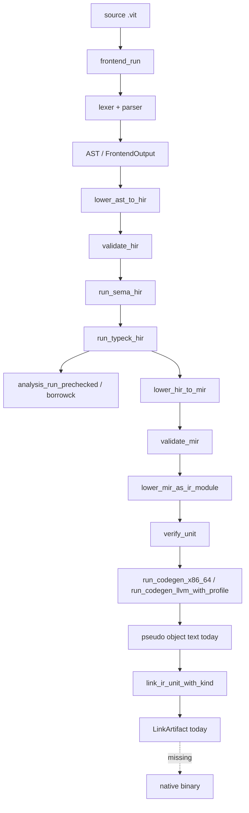

# AUDIT - Vitte compiler real pipeline

Date: 2026-05-21

## Verdict court

Le depot contient beaucoup de pipeline compiler reel (frontend, HIR, sema, typeck, MIR, IR, codegen, link artifact), mais le binaire actuel n'est pas encore un compilateur natif complet au sens `source -> objet machine -> linker -> executable`.

Le point d'entree source est bien `src/vitte/compiler/driver/compiler.vit`. `main(args)` est maintenant cable cote source, mais le runtime CLI actuel vient encore du bootstrap genere tant que stage2 ne compile pas ce point d'entree en executable natif.

## Executables trouves

Total fichiers visibles par `find . -type f`: 7929. Fichiers hors caches/build/target/pkgout: 2096.

```text
bin/vitte
bin/vittec
bin/vittec0
bin/vittec1
docs/book/chapters/keywords/scripts/lint_keywords.py
docs/book/chapters/keywords/scripts/normalize_keywords.py
docs/book/grammar/scripts/build_railroad.py
docs/book/grammar/scripts/sync_grammar.py
docs/book/grammar/scripts/validate_examples.py
docs/book/scripts/add_representative_examples.py
docs/book/scripts/check_chapter_length.py
docs/book/scripts/check_links.py
docs/book/scripts/check_structure.py
docs/book/scripts/expand_chapters_to_min_length.py
docs/book/scripts/generate_poche_chapters.py
docs/book/scripts/humanize_chapters.py
docs/book/scripts/lint_keywords_style.py
docs/book/scripts/qa_book.py
docs/book/scripts/rewrite_11_20_human.py
docs/book/scripts/rewrite_first10_human.py
docs/book/scripts/sync_grammar_surface.py
editors/geany/install_geany.sh
editors/geany/uninstall_geany.sh
scripts/seed/install_seed.sh
scripts/seed/rotation_report.sh
scripts/seed/update_manifest.sh
scripts/seed/verify_seed.sh
tests/docs/test_ebnf_memory_sync.py
tests/docs/test_grammar_sync.py
toolchain/bootstrap.sh
toolchain/scripts/bootstrap/stage1.sh
toolchain/scripts/bootstrap/stage2.sh
toolchain/scripts/bootstrap/verify.sh
toolchain/scripts/ci/artifacts.sh
toolchain/scripts/ci/github-actions.sh
toolchain/scripts/dev/repl.sh
toolchain/scripts/dev/run-vittec.sh
toolchain/scripts/install/install-local.sh
toolchain/scripts/install/install-prefix.sh
toolchain/scripts/package/audit-debian-deb.sh
toolchain/scripts/package/bundle-runtime.sh
toolchain/scripts/package/bundle-stdlib.sh
toolchain/scripts/package/bundle-toolchain.sh
toolchain/scripts/package/checksum.sh
toolchain/scripts/package/make-archive.sh
toolchain/scripts/package/make-debian-deb.sh
toolchain/scripts/package/make-debian-uninstall-deb.sh
toolchain/scripts/package/make-macos-pkg.sh
toolchain/scripts/package/make-macos-uninstall-pkg.sh
toolchain/scripts/package/make-tarball.sh
toolchain/scripts/test/run.sh
toolchain/scripts/test/stdlib.sh
toolchain/seed/vittec0.seed
toolchain/test_bootstrap_reproducibility.sh
tools/beta_feedback/generate_kpi_report.py
tools/beta_feedback/update_matrix_from_summary.py
tools/beta_feedback/validate_feedback_csv.py
tools/bootstrap_contracts_index_check.sh
tools/bootstrap_hard_gate.py
tools/bootstrap_native_fixture_matrix.sh
tools/bootstrap_native_snapshots.sh
tools/bootstrap_posix_smoke.sh
tools/bootstrap_selfhost_repro.sh
tools/bootstrap_vitte_hard_gate.sh
tools/build_arduino_projects.sh
tools/build_book_learning_layer.py
tools/build_core_projects.sh
tools/build_docs_site.py
tools/build_examples_matrix.sh
tools/build_grammar_extras.py
tools/build_grammar_practical_page.py
tools/check_book_pedagogy.py
tools/check_bootstrap_native_drift.sh
tools/check_bootstrap_source_coverage.sh
tools/check_broken_internal_links.py
tools/check_compiler_entry_lock.sh
tools/check_compiler_path_typos.sh
tools/check_diagnostics_migration.sh
tools/check_docs_en_only.py
tools/check_docs_perf.py
tools/check_geany_install.sh
tools/check_html_page_sizes.py
tools/check_manifest.sh
tools/check_module_shape_policy.py
tools/check_no_duplicate_css.py
tools/check_no_duplicate_scripts.py
tools/check_posix_seed_shell.sh
tools/check_seed_contract.sh
tools/check_stage2_source_of_truth.sh
tools/check_stdlib_abi_compat.py
tools/check_tests.sh
tools/ci_fast_compiler.sh
tools/ci_surface_legacy_audit.sh
tools/cli_diagnostics_snapshots.sh
tools/compile_all_compiler_files.sh
tools/compiler_effective_gate/check.py
tools/compiler_max_gate.sh
tools/compiler_reachability_audit.py
tools/compiler_topology/generate_artifacts.py
tools/compiler_topology/run_checks.py
tools/completions_fallback_test.sh
tools/completions_snapshots.sh
tools/contracts_dashboard.py
tools/crash_report_snapshots.sh
tools/determinism_smoke.sh
tools/diag_snapshots.sh
tools/docs/check_assets_policy.py
tools/docs/post_deploy_css_monitor.sh
tools/docs/refresh_assets_policy.py
tools/docs/verify_local_pages.sh
tools/docs_doctor.py
tools/docs_health_all.sh
tools/docs_pipeline.sh
tools/docs_sync_gate.py
tools/doctor.sh
tools/dx_hello_prod_bench.py
tools/explain_snapshots.sh
tools/ffi/generate_abi_coverage_report.py
tools/ffi/update_matrix_abi_coverage.py
tools/ffi/validate_abi_profiles.py
tools/fix_broken_script_tags.py
tools/frequent_diag_autofix_check.py
tools/generate_editor_highlights.py
tools/generate_legacy_migration_doc.py
tools/generate_make_targets_doc.py
tools/generate_vitteos_status.sh
tools/golden_runner
tools/highlight_snapshot_emacs.sh
tools/highlight_snapshot_geany.sh
tools/highlight_snapshot_nano.sh
tools/highlight_snapshot_vim.sh
tools/highlights_coverage.py
tools/highlights_snapshot.py
tools/hooks/pre-commit-modules-snapshots.sh
tools/incremental_cache_smoke.sh
tools/interproc_opt/generate_artifacts.py
tools/interproc_opt/run_checks.py
tools/lint_contract_lockfiles.py
tools/lint_critical_module_contracts.py
tools/lint_critical_runtime_matrix.py
tools/lint_docs_tokens.py
tools/lint_experimental_modules.py
tools/lint_legacy_import_paths.py
tools/lint_module_naming.py
tools/lint_module_tree.py
tools/lint_new_public_packages_have_snapshots.py
tools/lint_no_std_imports.py
tools/lint_package_layout.py
tools/lint_packages_governance.py
tools/lint_plugin_manifest.py
tools/lint_plugin_sandbox_permissions.py
tools/lint_public_modules_have_snapshots.py
tools/lint_stdlib_api.py
tools/llvm/generate_artifacts.py
tools/llvm/run_checks.py
tools/llvm/write_native_manifest.py
tools/lsp_completion_bench.py
tools/migrate_book_pedagogy_target.py
tools/migration_fix_preview.sh
tools/minify_assets.sh
tools/mir_opt/generate_artifacts.py
tools/mir_opt/run_checks.py
tools/mod_migrate_imports.sh
tools/modules_snapshots.sh
tools/modules_tests.sh
tools/native_json_schema_contract_test.sh
tools/negative_tests.sh
tools/new_module_starter.sh
tools/optimization_phase2/generate_kpi_report.py
tools/optimization_phase2/update_matrix_from_summary.py
tools/optimization_phase2/validate_phase2_csv.py
tools/package_check_all.sh
tools/package_check_portable.sh
tools/packages_contract_snapshots.sh
tools/parse_modules_tests.sh
tools/parse_tests.sh
tools/parse_watch.sh
tools/parser_bootstrap_surface_test.py
tools/parser_lexer_fuzz_smoke.py
tools/perf_budget_check.py
... (35 more)
```

## Vrai main CLI

- Entree stage2 declaree: `src/vitte/compiler/driver/compiler.vit`.
- `src/vitte/compiler/driver/compiler.vit::main(args)`: dispatcher source cable.
- Commandes runtime observees par `./bin/vittec --help`:

```text
vittec2 stage2 compiler driver
version: vittec2 stage2-vitte 0.1.0
commands: parse check build-native dump-native-ir build selfhost-source --version --help
flags: --src PATH --out PATH --stage NAME --trace-pipeline --strict --dump-ast-json --dump-hir-json --dump-mir-json --diagnostics-json
```

## Commandes build/check/run/test

- `vittec check tests/golden/frontend/fixtures/hello_min.vit`: rc=0.
- `vittec build tests/golden/frontend/fixtures/hello_min.vit -o target/audit_hello`: rc=2.
- `vittec run tests/golden/frontend/fixtures/hello_min.vit`: rc=2.
- `vittec test tests/golden/frontend/fixtures/hello_min.vit`: rc=2.

Sorties importantes:

```text
[vittec2][error] E_CLI_STAGE: unsupported stage:  (hint: supported: stage1)
[vittec2][error] E_CLI_COMMAND: unknown command: run (hint: use --help to list commands)
[vittec2][error] E_CLI_COMMAND: unknown command: test (hint: use --help to list commands)
```

## Graphe du pipeline reel



## Modules compiler/*

- Modules `.vit` sous `src/vitte/compiler`: 220.
- Modules non-test atteignables depuis `driver/compiler`: 194 / 194.
- Modules non-test atteignables depuis les racines de pipeline reel (`driver/compile`, `driver/pipeline`, `backend/pipeline`): 61 / 194.

## Modules morts ou non utilises par le pipeline reel

```text
vitte/compiler/analysis/borrowck/lifetimes
vitte/compiler/analysis/borrowck/loans
vitte/compiler/analysis/borrowck/mod
vitte/compiler/analysis/borrowck/moves
vitte/compiler/analysis/borrowck/ownership
vitte/compiler/analysis/borrowck/regions
vitte/compiler/analysis/const_eval/evaluator
vitte/compiler/analysis/const_eval/folding
vitte/compiler/analysis/const_eval/interpreter
vitte/compiler/analysis/const_eval/mod
vitte/compiler/analysis/lint/engine
vitte/compiler/analysis/lint/mod
vitte/compiler/analysis/lint/report
vitte/compiler/analysis/lint/rules
vitte/compiler/analysis/mod
vitte/compiler/analysis/sema/mod
vitte/compiler/analysis/sema/modules
vitte/compiler/analysis/sema/names
vitte/compiler/analysis/sema/resolver
vitte/compiler/analysis/sema/visibility
vitte/compiler/analysis/static/mod
vitte/compiler/analysis/typeck/mod
vitte/compiler/backend/codegen/emitter
vitte/compiler/backend/codegen/instruction_select
vitte/compiler/backend/codegen/machine
vitte/compiler/backend/codegen/mod
vitte/compiler/backend/codegen/object
vitte/compiler/backend/codegen/register_alloc
vitte/compiler/backend/ir/block
vitte/compiler/backend/ir/function
vitte/compiler/backend/ir/instruction
vitte/compiler/backend/ir/mod
vitte/compiler/backend/ir/module
vitte/compiler/backend/ir/verify
vitte/compiler/backend/link/mod
vitte/compiler/backend/mod
vitte/compiler/backend/target/mod
vitte/compiler/backend/target/riscv64
vitte/compiler/backend/target/x86_64
vitte/compiler/backends/backend_infrastructure
vitte/compiler/backends/c_emit
vitte/compiler/backends/llvm_bindings/mod
vitte/compiler/backends/llvm_emit
vitte/compiler/backends/vitte_emit/abi_bridge
vitte/compiler/backends/vitte_emit/cfg
vitte/compiler/backends/vitte_emit/config
vitte/compiler/backends/vitte_emit/contracts
vitte/compiler/backends/vitte_emit/emit
vitte/compiler/backends/vitte_emit/intrinsics
vitte/compiler/backends/vitte_emit/ir
vitte/compiler/backends/vitte_emit/lowering
vitte/compiler/backends/vitte_emit/mod
vitte/compiler/backends/vitte_emit/passes
vitte/compiler/backends/vitte_emit/pipeline
vitte/compiler/backends/vitte_emit/types
vitte/compiler/backends/vitte_emit/validate
vitte/compiler/backends/wasm/mod
vitte/compiler/diagnostics/json
vitte/compiler/diagnostics/lsp
vitte/compiler/diagnostics/mod
vitte/compiler/diagnostics/render
vitte/compiler/diagnostics/report
vitte/compiler/driver/cli
vitte/compiler/driver/compiler
vitte/compiler/driver/mod
vitte/compiler/frontend/ast/mod
vitte/compiler/frontend/ast/pretty
vitte/compiler/frontend/ast/visitor
vitte/compiler/frontend/grammar_alignment_checker
vitte/compiler/frontend/lexer/mod
vitte/compiler/frontend/macros/errors
vitte/compiler/frontend/macros/mod
vitte/compiler/frontend/mod
vitte/compiler/frontend/parse/lookahead
vitte/compiler/frontend/parse/mod
vitte/compiler/frontend/parse/precedence
vitte/compiler/frontend/source_map
vitte/compiler/infrastructure/diagnostics/colors
vitte/compiler/infrastructure/diagnostics/diagnostic
vitte/compiler/infrastructure/diagnostics/emitter
vitte/compiler/infrastructure/diagnostics/labels
vitte/compiler/infrastructure/diagnostics/mod
vitte/compiler/infrastructure/diagnostics/suggestions
vitte/compiler/infrastructure/errors/code
vitte/compiler/infrastructure/errors/mod
vitte/compiler/infrastructure/errors/registry
vitte/compiler/infrastructure/errors/severity
vitte/compiler/infrastructure/incremental/dep_graph
vitte/compiler/infrastructure/incremental/fingerprint
vitte/compiler/infrastructure/incremental/invalidation
vitte/compiler/infrastructure/incremental/mod
vitte/compiler/infrastructure/incremental/reuse
vitte/compiler/infrastructure/mod
vitte/compiler/infrastructure/session/config
vitte/compiler/infrastructure/session/context
vitte/compiler/infrastructure/session/files
vitte/compiler/infrastructure/session/mod
vitte/compiler/infrastructure/session/options
vitte/compiler/ir/ast
vitte/compiler/ir/hir_to_mir_lowering
vitte/compiler/ir/mir_extended
vitte/compiler/ir/mir_optimizations
vitte/compiler/ir/pipeline
vitte/compiler/middle/borrow/checks
vitte/compiler/middle/borrow/mod
vitte/compiler/middle/borrow/regions
vitte/compiler/middle/dataflow/cfg
vitte/compiler/middle/dataflow/liveness
vitte/compiler/middle/dataflow/mod
vitte/compiler/middle/hir/builder
vitte/compiler/middle/hir/control_flow
vitte/compiler/middle/hir/mod
vitte/compiler/middle/hir/pretty
vitte/compiler/middle/infer/constraints
vitte/compiler/middle/infer/mod
vitte/compiler/middle/infer/solver
vitte/compiler/middle/lower/lowering_context
vitte/compiler/middle/lower/mod
vitte/compiler/middle/mir/builder
vitte/compiler/middle/mir/dataflow
vitte/compiler/middle/mir/mod
vitte/compiler/middle/mir/pretty
vitte/compiler/middle/mir/transform
vitte/compiler/middle/mod
vitte/compiler/middle/typecheck/diagnostics
vitte/compiler/middle/typecheck/mod
vitte/compiler/middle/typecheck/rules
vitte/compiler/mod
vitte/compiler/prelude
vitte/compiler/version
```

## Placeholders / stubs / mocks / unimplemented

```text
No high-priority placeholder remains in the active compiler entry surface after the cleanup pass.
```
