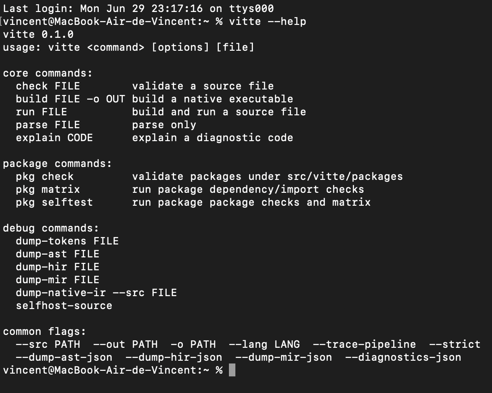

# Vitte

<div align="center">
<h3>A modern systems programming language focused on deterministic compilation, safety and self-hosting.</h3>
<p>


</p>
</div>

## Features


Vitte is a modern systems programming language and compiler designed around explicit compilation stages, deterministic builds, memory safety, and long-term maintainability.

### Safety Model

Vitte tracks ownership as a compile-time contract: the compiler checks which scope owns a value, how borrows flow through the program, and whether a moved value is reused incorrectly.

Temporal Ownership extends that model with lifetime intent: the compiler verifies not only who owns a value, but also how long that value is allowed to remain valid. The borrow checker now exposes temporal ownership windows that reject aliases whose valid range outlives their owner; deeper full-language temporal coverage remains part of the ongoing safety work.

Memory Regions are first-class at the active language surface: `region` is tokenized, parsed as a top-level declaration, preserved through AST/HIR lowering, and checked by the borrow checker region model. The current contract binds places to declared memory regions and rejects values that escape after their region closes; allocator/runtime placement remains future backend work.

Compile-Time Simulation is the static execution layer for selected deterministic program fragments. The const-eval gate now simulates constant `if` and `while` conditions, rejects unreachable constant-false paths, and reports logical mistakes before code generation alongside const evaluation, diagnostics, and MIR validation.

## Compiler progress


Overall progress: **46%**

```text

█████░░░░░░░░░░░░░░░ 46%

```

## Component | Status 

### Roadmap

```text

Lexer              ██████████  100%

Parser             ██████████  100%

AST                ██████████  100%

HIR                █████░░░░░  55%

Semantic           ███░░░░░░░  35%

Type Checker       ███░░░░░░░  35%

Borrow Checker     ███████░░░  70%

MIR                █████░░░░░  50%

IR                 █████░░░░░  50%

Backend            ██████░░░░  60%

LLVM               ██████████  100%

Self Hosting       █████░░░░░  50%

```

## Repository

This repository contains the Vitte compiler, bootstrap toolchain, language grammar, tests, and documentation.

The percentages above are maturity estimates from the engineering audit, not claims that a component is feature-complete. A `bin/vitte check` gate or helper-level test proves a specific contract, but it does not make the full language/compiler surface complete.

Lexer status is marked at 100% for the active EBNF lexical surface: `frontend-lexer-test` now checks the scanner tests and `tools/lexer_ebnf_surface_check.py`, which classifies every quoted terminal in `src/vitte/grammar/vitte.ebnf` against lexer support.

Parser status is marked at 100% for active grammar coverage reporting: `grammar-coverage` runs `tools/parser_sync_coverage_report.py --check`, currently reports `missing=0`, and blocks green status when any grammar rule is unclassified or missing. This is not a claim that every rule is fully AST-built or semantically complete; those remain tracked by AST, HIR, semantic, and type-checking lines.

AST status is marked at 100% for the active non-lexical parsed grammar surface: `frontend-ast-test` runs `src/vitte/compiler/tests/ast_tests.vit` and `tools/ast_coverage_gate.py`, which fails when any non-lexical EBNF rule is parsed without AST construction evidence. Lexical rules remain owned by the lexer gate.

LLVM status is marked at 100% for the checked LLVM adapter and native smoke contract: `llvm-backend-gate` runs the Vitte LLVM tests, LLVM bindings smoke test, backend validation, artifact generation, report-content checks, and the conditional `llvm-native-final-gate`. The native final gate proves a bootstrap Vitte source can become LLVM IR, compile to a native object with `clang`, link, and run when the host toolchain is available.

Self-hosting is exercised by compiling the compiler entrypoint with the current toolchain, but full self-hosting parity is still partial:

```bash
bin/vitte build src/vitte/compiler/main.vit -o target/selfhost/compiler_main
```

MIR and IR have real lowering, validation, and regression coverage for canonical borrow, nominal-call, and control-flow paths. They are still not complete optimization or backend contract surfaces.

Key directories:

- `src/vitte/compiler` — compiler frontend, middle-end, backend, driver  
- `src/vitte/grammar` — language grammar source  
- `toolchain/` — bootstrap stages and workflows  
- `tests/` — regression and validation tests  
- `tools/` — scripts for checks and synchronization  
- `docs/` — documentation and reports  

Grammar source of truth: `src/vitte/grammar/vitte.ebnf`

## Pipeline

## Command-line Interface

The `vitte` command provides access to the compiler, project management utilities, diagnostics, formatting, documentation, and package management.

### `vitte --help`

The following screenshot shows the current command-line help output.

<h2 align="center">Vitte Command-Line Interface</h2>

<p align="center">
  
</p>

<p align="center">
  <em>Output of <code>vitte --help</code></em>
</p>
The CLI is organized into functional groups:

- **Project** — create, initialize, and manage Vitte projects.

- **Build** — parse, check, build, and run source code.

- **Diagnostics** — explain compiler diagnostics and inspect the environment.

- **Formatting** — format source code consistently.

- **Documentation** — access manuals and reference documentation.

- **Package Manager** — manage dependencies and packages.

- **Utilities** — additional development and maintenance commands.

Run the help command at any time to see the latest list of available commands:

```bash

vitte --help

```
Failures are explicit and machine-readable to aid tooling.

## Quick start

Run a basic check:

```bash
vitte check main.vit
```

Dump diagnostics in JSON:

```bash
vitte check main.vit --diagnostics-json
```

Build a test binary:

```bash
vitte build src/vitte/compiler/tests/pipeline_tests.vit -o /tmp/vitte-pipeline-tests
```

Run main test gates:

```bash
./tools/compiler_test_suite_check_gate.sh
./tools/compiler_test_suite_bridge_gate.sh
```

Browse documentation:

- Language spec: `docs/spec/language.md`  
- Compiler docs: `docs/compiler/architecture.md`  
- Bootstrap docs: `docs/bootstrap/overview.md`  
- Generated site: `docs/index.html`  

## Example

```vitte
space hello/app

proc main() -> int {
  give 0;
}
```

## Project statistics

- Language: Vitte  
- Bootstrap: C17  
- Primary target: native executables  
- Intermediate representations: AST, HIR, MIR, IR  
- Supported architectures: x86_64, AArch64, RISC-V64, i386  
- Diagnostics: rich structured diagnostics  
- Goal: complete self-hosting compiler  

## Documentation

Key documentation:

- `docs/index.html`  
- `docs/start-here.html`  
- `docs/compiler/architecture.md`  
- `docs/compiler/pipeline.md`  
- `docs/compiler/backend.md`  
- `docs/bootstrap/overview.md`  
- `docs/spec/language.md`  

## Contributing

Contributions should be focused, explicit, and tested. Avoid hand-editing generated artifacts unless necessary.

## Summary

Vitte is an experimental systems programming language and compiler project emphasizing clear compiler engineering, deterministic builds, and maintainable systems programming.
