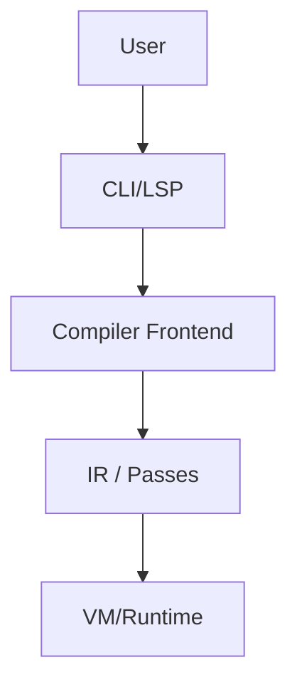

---

rfc: 0000

#  Remplacer par le numéro à 4 chiffres — voir rfcs/index.md


discussions-to: "[https://github.com/vitte-lang/vitte/discussions/…](https://github.com/vitte-lang/vitte/discussions/…)"
target-release: "v0.x"
labels: \["lang", "vm", "compiler", "tools", "lsp", "breaking?", "security"]
----------------------------------------------------------------------------

> **Résumé en une phrase**: *Qu’allons-nous changer, pourquoi, et pour qui ?*
> **TL;DR (≤ 5 lignes)**: *Problème → Proposition → Impact → Rollout.*

---

## 0) Table des matières

* [0) Table des matières](#0-table-des-matières)
* [1) Motivation](#1-motivation)
* [2) Objectifs / Non-objectifs](#2-objectifs--non-objectifs)
* [3) Contexte & cas d’usage](#3-contexte--cas-dusage)
* [4) Design – Vue d’ensemble](#4-design--vue-densemble)
* [5) Design – Spécification détaillée](#5-design--spécification-détaillée)
* [6) Compatibilité & migrations](#6-compatibilité--migrations)
* [7) Sécurité / Privacy / Menaces](#7-sécurité--privacy--menaces)
* [8) Performance & mesures](#8-performance--mesures)
* [9) i18n / a11y](#9-i18n--a11y)
* [10) Écosystème & outils](#10-écosystème--outils)
* [11) Déploiement & feature-gating](#11-déploiement--feature-gating)
* [12) Plan de test & validation](#12-plan-de-test--validation)
* [13) Alternatives considérées](#13-alternatives-considérées)
* [14) Questions ouvertes / Risques](#14-questions-ouvertes--risques)
* [15) Appendix (grammaire, pseudo-code, exemples)](#15-appendix-grammaire-pseudo-code-exemples)
* [16) Glossaire & références](#16-glossaire--références)

---

## 1) Motivation

* **Douleur actuelle** : décrire le problème utilisateur/développeur (avec exemples concrets).
* **Pourquoi maintenant ?** : fenêtres d’opportunité, bloqueurs aval.
* **Success criteria** : comment saura-t-on que c’est réussi ? (KRs mesurables)

> *Règle d’or :* pas de solution déguisée en problème. Parlez d’impact, pas d’implémentation.

## 2) Objectifs / Non-objectifs

**Objectifs**

* O1 — …
* O2 — …

**Non‑objectifs** (volontairement exclus)

* N1 — …
* N2 — …

## 3) Contexte & cas d’usage

* **Personas / scénarios** : qui bénéficie, comment ?
* **Exemples minimalistes** : avant → après.
* **Contrainte(s) réglementaire(s)** éventuelle(s) (licences, brevets, conformité).

## 4) Design – Vue d’ensemble

> *Sketch global du système.*
> Diagrammes encouragés :



* **Principes** : simplicité, lisibilité, invariants.
* **Interfaces clés** : API/ABI/CLI à survol haut niveau.
* **Données** : formats, schémas, contrats.

## 5) Design – Spécification détaillée

### 5.1 Syntaxe / Grammaire (si applicable)

```ebnf
<expr> ::= <lit> | <ident> | <lambda> | <app> | <let> ;
```

### 5.2 Sémantique / Typage

* Règles d’inférence, contraintes, erreurs.
* Effets / pureté / async / ownership.

### 5.3 API / ABI

* Signatures publiques (stables), versions, compat.

```rust
pub fn compile(input: &str, opts: &Options) -> Result<Artifact, Error>;
```

### 5.4 CLI / UX

* Sous‑commandes, flags, messages d’erreur, codes retour.

```text
vitte build --target wasm32 --release
```

### 5.5 Formats & Fichiers

* Schémas JSON/TOML/Binary (versionnés), magic bytes, endianness.

### 5.6 VM / Bytecode (si applicable)

* OpCodes nouveaux/changés, contraintes, invariants de vérif.

### 5.7 Migration interne (codebase)

* Modules touchés, dépendances, refactoring nécessaire.

## 6) Compatibilité & migrations

* **Compat descendante** : garanti / best‑effort / non.
* **Flags de compat** : comment les activer.
* **Plan de migration** : étapes, scripts, warnings, déprécations.
* **Politique SemVer** : (major/minor/patch) impact.

## 7) Sécurité / Privacy / Menaces

* **Modèle de menace** (STRIDE)

| Catégorie       | Risque | Mitigation |
| --------------- | ------ | ---------- |
| Spoofing        | …      | …          |
| Tampering       | …      | …          |
| Repudiation     | …      | …          |
| Info Disclosure | …      | …          |
| DoS             | …      | …          |
| Elevation       | …      | …          |

* **Surface d’attaque** : parsing, FFI, plugins, sandbox.
* **Données perso** : collecte, anonymisation, rétention, opt‑out.
* **Supply‑chain** : signatures, provenance, SBOM.

## 8) Performance & mesures

* **Complexité** : big‑O, mémoire.
* **Benchmarks** : micro/macro, datasets, `criterion`.
* **Régressions** : garde‑fous CI, budgets perf.

## 9) i18n / a11y

* Messages localisables, encodages, LTR/RTL.
* Accessibilité outils/IDE (contrastes, raccourcis, lecteurs d’écran).

## 10) Écosystème & outils

* **LSP/IDE** : diagnostics, code actions, hovers.
* **Toolchain** : fmt, lints, test, debug/profiling.
* **Packaging** : `vitpm` (manifest, lock, registry).

## 11) Déploiement & feature-gating

* **Feature flags** : `unstable-foo`, `--enable=…`.
* **Rollout** : canary → opt‑in → par défaut → stabilisation.
* **Plan de rollback** : comment désactiver vite.

## 12) Plan de test & validation

* **Unitaires** : cas nominaux & bords.
* **Intégration** : bout‑en‑bout (CLI → IR → VM).
* **Conformité** : suites officielles, golden tests.
* **Fuzzing / PBT** : `proptest`, corpus.
* **Acceptance criteria** : cases à cocher ci‑dessous.

### Checklist d’acceptation

* [ ] Spécification complète & lisible
* [ ] Tests unitaires écrits
* [ ] Benchmarks clés en place
* [ ] Diagnostics UX validés (messages)
* [ ] Sécurité revue (STRIDE rempli)
* [ ] i18n/a11y passées en revue
* [ ] Plan de migration outillé

## 13) Alternatives considérées

* A1 — … (avantages/inconvénients)
* A2 — …
* *Pourquoi la proposition actuelle gagne‑t‑elle ?*

## 14) Questions ouvertes / Risques

* Q1 — …
* Risques & mitigations — …

> **Décisions actées** (changelog) :
>
> * JJ/MM — *Decision Record* : …
> * JJ/MM — …

## 15) Appendix (grammaire, pseudo-code, exemples)

### 15.1 Pseudo-code (référence non normative)

```text
W(e, Γ):
  match e:
    Var x    -> instantiate(Γ[x])
    Lam x.e' -> let a=fresh() in Γ' = Γ[x ↦ a]; a -> W(e', Γ')
    App f x  -> let tf=W(f,Γ); tx=W(x,Γ); let r=fresh(); unify(tf, tx -> r); r
```

### 15.2 Exemples complets

```vitte
let id = \x -> x
id(42) -- Int
```

### 15.3 Schémas / JSON

```json
{
  "version": 1,
  "artifact": "vitbc",
  "sections": ["code", "data"]
}
```

## 16) Glossaire & références

**Glossaire** : HM, SSA, IR, ABI, FFI, LSP, SBOM, …

**Références / inspirées par** :

* Rust RFCs, Swift Evolution, TC39, Python PEPs
* Papers / posts (citer proprement)

---

## Annexes pratiques

### A) Modèle de PR (copier/coller)

```markdown
**Titre:** RFC NNNN: <titre>

**Résumé:** <1-2 phrases>

**Statut:** draft → proposed (cocher quand prêt)
- [ ] Ready for review
- [ ] Tests/Bench en place
- [ ] Impact tooling évalué (fmt, lints, LSP)

**Risques / mitigations:** …

**Plan de déploiement:** …

Liens: RFC, issues, discussions
```

### B) En‑tête de fichier & nommage

* Fichier: `rfcs/NNNN-titre-kebab.md` (NNNN = 4 chiffres).
* Front‑matter : voir le bloc YAML en haut, **obligatoire**.

### C) Licence

* Par défaut, contributions sous **Apache‑2.0**, comme le repo principal.

> *“On vise clair, droit, efficace. Le reste n’est que littérature.”* 🏹
